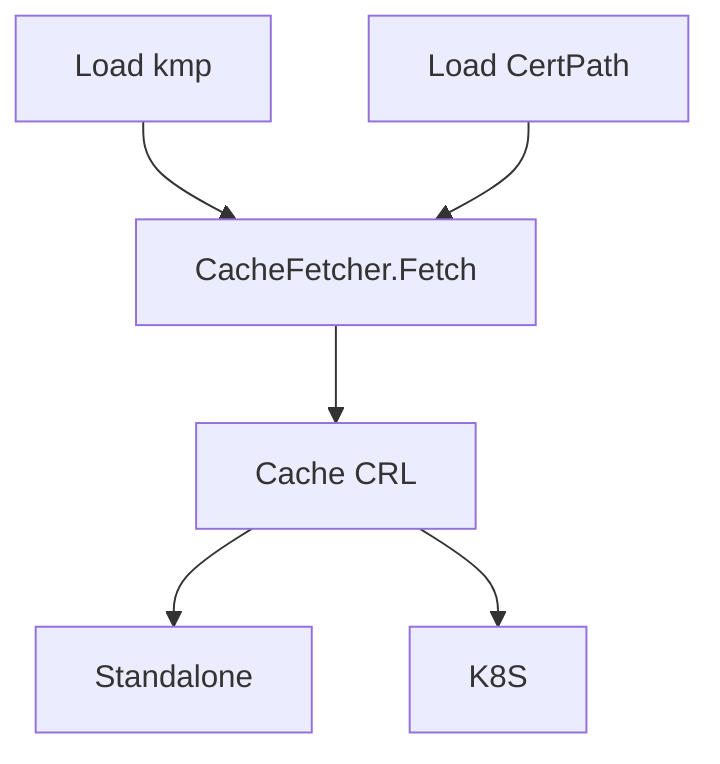

# CRL and CRL Cache Design

## Intro

What to implement and why. e.g. CRL is not support for now but it is a necessary feat mentioned in notation spec.

## Goals

- Bump-up CRL support
- Define a cache provider interface for CRL
- Update CRL and CRL caching related documentation
- Implement default file-based cache implementation for both CLI and K8S
- Implement preload CRL when cert added from KMP

## Brief Aside about CRL and CRL Cache

X.509 defines one method of certificate revocation. This method involves each CA periodically issuing a signed data structure called a certificate revocation list (CRL).

A CRL is a time stamped list identifying revoked certificates which is signed by a CA or CRL issuer and made freely available in a public repository. Each revoked certificate is identified in a CRL by its certificate serial number.

When a certificate-using system uses a certificate (e.g., for verifying a remote user's digital signature), that system not only checks the certificate signature and validity but also acquires a suitably-recent CRL and checks that the certificate serial number is not on that CRL.
The meaning of "suitably-recent" may vary with local policy, but it usually means the most recently-issued CRL.

A new CRL is issued on a regular periodic basis (e.g., hourly, daily, or weekly).
An entry is added to the CRL as part of the next update following notification of revocation. An entry MUST NOT be removed from the CRL until it appears on one regularly scheduled CRL issued beyond the revoked certificate's validity period.

Implementations of the [Notary Project verification specification](./signing-and-verification-workflow.md) support only HTTP CRL URLs.

## Design Points

**Why Caching**

Preload CRL can help improve the performance verifier from download CRLs when a single CRL can be up to 64MiB.

Prefer ratify cache for reuse the cache provider interface. Reusing interfaces reduces redundant expressions, helps you easily maintain application objects

## Proposed Design



### CRLCacheProvider interface
```
// an interface that support CRL cache 
// a combination of current CacheProvider and Fetcher 

type CRLCacheProvider interface {
    // Get returns the string, json-marshalled value linked to key. Returns true/false for existence
    Get(ctx context.Context, key string) (string, bool)

    // Set adds value based on key to cache. Assume there will be no ttl. Returns true/false for success
    Set(ctx context.Context, key string, value interface{}) bool

    // SetWithTTL adds value based on key to cache. Ties ttl of entry to ttl provided. Returns true/false for success
    SetWithTTL(ctx context.Context, key string, value interface{}, ttl time.Duration) bool

    // Delete removes the specified key/value from the cache
    Delete(ctx context.Context, key string) bool
    
    // SetNextUpdate update the latest nextUpdate value for cache data metadata
    SetNextUpdate(ctx context.Context, value interface{}) bool
    
    // Fetch fetches crl from cache or CRL Distribution Point (CDP)
    Fetch(ctx context.Context, crlURL string) (bundle *cache.Bundle, fromCache bool, err error)
}
```

### What is in cache
    
key: 
- `uri` in type `string`

value: 
- `bundle` in type `*Bundle`
- `ttl` / `NextUpdate`: in type `time.Time`

```
// creates an expiring cache
expires := bundle.Metadata.CreatedAt.Add(cache.MaxAge)
if cache.MaxAge > 0 && time.Now().After(expires) {
	return nil, ErrCacheMiss
}

// check validity
now := time.Now()
if !crl.NextUpdate.IsZero() && now.After(crl.NextUpdate) {
	return fmt.Errorf("expired CRL. Current time %v is after CRL NextUpdate %v", now, crl.NextUpdate)
}
```

### Create Cache

Create cache is triggerred after load certed either from Path(CLI) or KMP(K8s)


#### Download CRL

CRL download location (URL) can be obtained from the certificate's CRL Distribution Point (CDP) extension. 
If the certificate contains multiple CDP locations then each location download is attempted in sequential order, until a 2xx response is received for any of the location. 

For each CDP location, Notary Project verification workflow will try to download the CRL for the default threshold of 5 seconds. The user may be able to configure this threshold. If the CRL cannot be downloaded within the timeout threshold the revocation result will be "revocation unavailable".

#### Save CRL to Cache

```
// Set stores the CRL bundle in the file system
func (c *CRLCache) Set(ctx context.Context, uri string, bundle *Bundle) error {
	if err := bundle.Validate(); err != nil {
		return err
	}
    
    // check closest expired date and set to `CRLCacheProvider`. Similar to `SetWithTTL`
    c.SetNextUpdate(bundle)

	// save to temp file
	tempFile, err := os.CreateTemp("", tempFileName)
	if err != nil {
		return err
	}
	if err := saveTar(tempFile, bundle); err != nil {
		return err
	}
	tempFile.Close()

	// rename is atomic on UNIX-like platforms
	return os.Rename(tempFile.Name(), filepath.Join(c.root, fileName(uri)))
}

```

### Provide Cache

#### Get Cache
```
// Get retrieves the CRL bundle from the file system
//
// - if the key does not exist, return ErrNotFound
// - if the CRL is expired, return ErrCacheMiss
func (c *CRLCache) Get(ctx context.Context, uri string) (bundle *Bundle, err error) {
	f, err := os.Open(filepath.Join(c.root, fileName(uri)))
	if err != nil {
		if os.IsNotExist(err) {
			return nil, ErrCacheMiss
		}
		return nil, err
	}
	defer func() {
		if cerr := f.Close(); cerr != nil && err == nil {
			err = cerr
		}
	}()

	bundle, err = parseBundleFromTar(f)
	if err != nil {
		return nil, err
	}

	expires := bundle.Metadata.CreatedAt.Add(c.MaxAge)
	if c.MaxAge > 0 && time.Now().After(expires) {
		// do not delete the file to maintain the idempotent behavior
		return nil, ErrCacheMiss
	}

	return bundle, nil
}
```
#### Refresh Cache

- When set cache, check closest expired date and set to `CRLCacheProvider`. Similar to `SetWithTTL`
- Config a refresh interval, monitor and refresh `CRLCacheProvider`
- Concurrency
Use synchronization primitives like mutexes to ensure thread safety during cache updates.

```
// Monitor starts a goroutine to monitor and refresh expired cache in CRLCacheProviders.
func (cf *CacheFactory) Monitor(refreshFunc func(string) interface{}, interval time.Duration) {
    go func() {
        for {
            time.Sleep(interval)
            for _, c := cf.getAllCRLCacheProvider() {
                c.ScanExpiredCRL(interval)
            }
        }
    }()
}

func (c *CRLCacheProvider) ScanExpiredCRL(interval time.Duration) {
    c.mu.Lock()
    for key, item := range c.CRLBundles {
        if item.Expiration.Before(time.Now()) {
            // Refresh the cache item
            newData := refreshFunc(key)
            c.items[key] = CacheItem{
                Data:       newData,
                Expiration: time.Now().Add(interval),
            }
        }
    }
    c.mu.Unlock()
}
```

# More details

**Revocation Checking with CRL**

To check the revocation status of a certificate against CRL, the following steps must be performed:

1. Verify the CRL signature.
1. Verify that the CRL is valid (not expired).
   A CRL is considered expired if the current date is after the `NextUpdate` field in the CRL.
1. Look up the certificate’s serial number in the CRL.
    1. If the certificate’s serial number is listed in the CRL, look for `InvalidityDate`.
       If CRL has an invalidity date and artifact signature is timestamped then compare the invalidity date with the timestamping date.
       1. If the invalidity date is before the timestamping date, the certificate is considered revoked.
       1. If the invalidity date is not present in CRL, the certificate is considered revoked.
    1. If the CRL is expired and the certificate is listed in the CRL for any reason other than `certificate hold`, the certificate is considered revoked.
    1. If the certificate is not listed in the CRL or the revocation reason is `certificate hold`, a new CRL is retrieved if the current time is past the time in the `NextPublish` field in the current CRL.
       The new CRL is then checked to determine if the certificate is revoked.
       If the original reason was `certificate hold`, the CRL is checked to determine if the certificate is unrevoked by looking for the `RemoveFromCRL` revocation code.

**rfc3280** 

REF: [Internet X.509 Public Key Infrastructure](https://www.rfc-editor.org/rfc/rfc3280#section-1)
