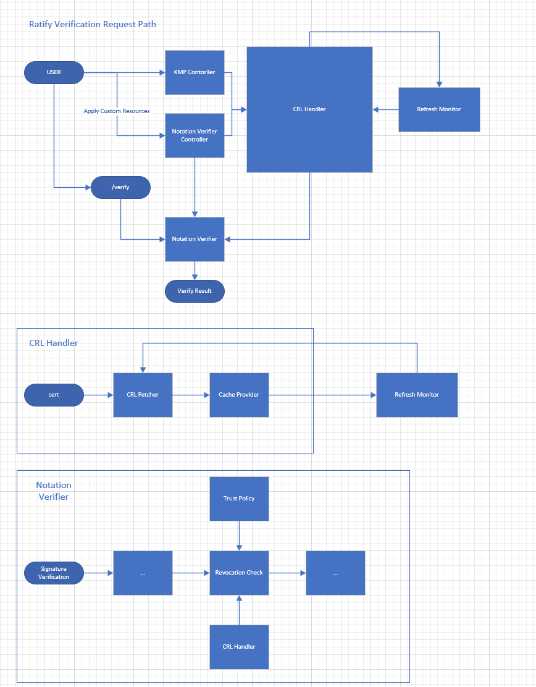

# CRL and CRL Cache Design

## Intro

Certificate validation is an essential step during signature validation. Currently Ratify supports checking for revoked certificates through OCSP supported by notation-go library. However, OCSP validation requires internet connection for each validation while CRL could be cached for better performance. As notary-project is adding the CRL support for notation signature validation, Ratify could utilize it.

OCSP URLs can be obtained from the certificate's authority information access (AIA) extension as defined in RFC 6960. If the certificate contains multiple OCSP URLs, then each URL is invoked in sequential order, until a 2xx response is received for any of the URL. For each OCSP URL, wait for a default threshold of 2 seconds to receive an OCSP response. The user may be able to configure this threshold. If OCSP response is not available within the timeout threshold the revocation result will be "revocation unavailable".

If both OCSP URLs and CDP URLs are present, then OCSP is preferred over CRLs. If revocation status cannot be determined using OCSP because of any reason such as unavailability then fallback to using CRLs for revocation check.

## Goals

CRL support, including CRL downloading, validation, and revocation list checks.

- Define a cache provider interface for CRL
- Implement default file-based cache implementation for both CLI and K8S
- Implement preload CRL when cert added from KMP
- Test plan for the CRL feature and performance test between CRL w/o cache.
- Update CRL and CRL caching related documentation

## Design Points

**How to Get CRL**

With no extra configuration, CRL download location (URL) can be obtained from the certificate's CRL Distribution Point (CDP) extension. If the CRL cannot be downloaded within the timeout threshold the revocation result will be "revocation unavailable". More details are showing in the Download CRL section

**Why Caching**

Preload CRL can help improve the performance verifier from download CRLs when a single CRL can be up to 32MiB. Prefer ratify cache for reuse the cache provider [interface](https://github.com/ratify-project/ratify/blob/dev/pkg/cache/api.go). Reusing interfaces reduces redundant expressions, helps you easily maintain application objects.

This design prefer file-based cache over memory-based one to ensure cache would still be available after service restarted. And in CLI scenario memory-based cache would not be applied.
Besides, by using memory-based cache, memory consumption and further cache expiring would increase the design complexity.

**Why Refresh CRL Cache**

A CRL is considered expired if the current date is after the `NextUpdate` field in the CRL. Verify that the CRL is valid (not expired) is necessary for revocation check. Monitoring and refreshing CRL on a regular basis can help avoid CRL download timetaken when doing verification by ensure the CRL is valid.

## Proposed Design




**Ratify Verification Request Path**:

Step 1: Apply the CRs including certs and CRL config

Step 2: Load CRLs from cert provided URLs // Implement CanCacheCRL() with GetCertificates() which includes all scenarios that introduce a new cert: KMP, KMP refresher and Verifer Config

Step 3: Trigger Refresh Monitor and set up refresh schedule // Refresher is based on build-in ticker

Step 4: Start verify task // Revocation list check is handled by notation verifier.

Step 5: Load trust policy // Get `Opt.Fetcher`

Step 6: Load CRL cache

**CRL Handler**:

Step 1: Load cert URLs from `[]*x509.Certificate`

Step 2: Download CRL

Step 3: Trigger Refresh Monitor, refresh monitor is [`time`](https://pkg.go.dev/time#example-NewTicker) pkg based.

### Cache Content Design

Key: 
- `uri` in type `string`

Value: 
- `*Bundle`
    - `NextUpdate` // nextUpdate can be get from bundle.BaseCRL.NextUpdate

Reference: [revocation/crl/bundle.go](https://github.com/notaryproject/notation-core-go/blob/main/revocation/crl/bundle.go)

Check CRL Cache Validity
```
// directly checks CRL validity
now := time.Now()
if !crl.NextUpdate.IsZero() && now.After(crl.NextUpdate) {
	// perform refresh
}
```

### Load CRL Cache

Load cache is triggerred after cert loaded from the either configurations.

#### Download CRL


Download is implemented by CRL `fetcher`, which can be done in parallel via start tasks in seperate go routines.

CRL download location (URL) can be obtained from the certificate's CRL Distribution Point (CDP) extension.
`notation-core-go` will download all CDP URLs because each CDP URL may belong to a different scope, and we cannot distinguish them.

For each CDP location, Notary Project verification workflow will try to download the CRL for the default threshold of 5 seconds. Ratify is able to configure this threshold. If the CRL cannot be downloaded within the timeout threshold the revocation result will be "revocation unavailable".

#### Save CRL to Cache

```
// Set stores the CRL bundle in the file system
// Check closest expired date and set to `CRLCacheProvider`.
// Save to temp file and avoid concurrency issue with atomic write operation
// `rename()` is atomic on UNIX-like platforms


// notation-go FScache

type fileCacheContent struct {
	// BaseCRL is the ASN.1 encoded base CRL
	BaseCRL []byte `json:"baseCRL"`

	// DeltaCRL is the ASN.1 encoded delta CRL
	DeltaCRL []byte `json:"deltaCRL,omitempty"`
}

// This cache builds on top of the UNIX file system to leverage the file system's
// atomic operations. The `rename` and `remove` operations will unlink the old
// file but keep the inode and file descriptor for existing processes to access
// the file. The old inode will be dereferenced when all processes close the old
// file descriptor. Additionally, the operations are proven to be atomic on
// UNIX-like platforms, so there is no need to handle file locking.
//
// NOTE: For Windows, the `open`, `rename` and `remove` operations need file
// locking to ensure atomicity. The current implementation does not handle
// file locking, so the concurrent write from multiple processes may be failed.
// Please do not use this cache in a multi-process environment on Windows.
```

### Provide CRL Cache

#### Get Cache from Provider

```
// Get retrieves the CRL bundle from the file system
// If the CRL is expired, return ErrCacheMiss


// Policy that uses custom verification level to relax the strict verification.
// It logs expiry and skips the revocation check.
"name": "use-expired-blobs",
    "signatureVerification": {
        "level" : "strict",
        "override" : {
            "expiry" : "log",
            "revocation" : "skip"
        }
    },

```
Reference: https://github.com/notaryproject/specifications/blob/main/specs/trust-store-trust-policy.md#signatureverification-details:~:text=Notary%20Project%20defines,scope%20(*).

#### Refresh Cache

Cache Data Structure: Store data along with expiration timestamps.

Monitor Scheduler: Use a scheduler (e.g., time.Ticker) to check the cache at regular intervals.

Concurrency: Use synchronization mechanisms like mutexes for thread-safe access to shared data.

Expiration Handling: When setting cache, check closest expired date that set to `CRLCacheProvider`. Compare the current time with the cache item's expiration. If expired, trigger the fetch process to update the data.

Error Handling and Retries: Implement error handling with retry logic in case of failed refresh operations.

Use synchronization primitives like mutexes to ensure thread safety during cache updates.

# Dev Work Items

- Implement CRL Fetcher based on notation-go library (~ 1-2 weeks)
- Implement file-based CRL Cache Provider (~ 2-3 weeks)
- Support loading CRLs from cert provided URLs, engage PM discussion (~ 1-2 weeks)
- Verifier performance test and Cache r/w performance test (~ 2-3 weeks)
- New e2e tests for different scenarios (~ 1 week)


# More details

**Brief Aside about CRL and CRL Cache**

X.509 defines one method of certificate revocation. This method involves each CA periodically issuing a signed data structure called a certificate revocation list (CRL).

A CRL is a time stamped list identifying revoked certificates which is signed by a CA or CRL issuer and made freely available in a public repository. Each revoked certificate is identified in a CRL by its certificate serial number.

When a certificate-using system uses a certificate (e.g., for verifying a remote user's digital signature), that system not only checks the certificate signature and validity but also acquires a suitably-recent CRL and checks that the certificate serial number is not on that CRL.
The meaning of "suitably-recent" may vary with local policy, but it usually means the most recently-issued CRL.

A new CRL is issued on a regular periodic basis (e.g., hourly, daily, or weekly).
An entry is added to the CRL as part of the next update following notification of revocation. An entry MUST NOT be removed from the CRL until it appears on one regularly scheduled CRL issued beyond the revoked certificate's validity period.

Implementations of the Notary Project verification specification support only HTTP CRL URLs.

**Revocation Checking with CRL**

To check the revocation status of a certificate against CRL, the following steps must be performed:

1. Verify the CRL signature.
1. Verify that the CRL is valid (not expired).
   A CRL is considered expired if the current date is after the `NextUpdate` field in the CRL.
1. Look up the certificate’s serial number in the CRL.
    1. If the certificate’s serial number is listed in the CRL, look for `InvalidityDate`.
       If CRL has an invalidity date and artifact signature is timestamped then compare the invalidity date with the timestamping date.
       1. If the invalidity date is before the timestamping date, the certificate is considered revoked.
       1. If the invalidity date is not present in CRL, the certificate is considered revoked.
    1. If the CRL is expired and the certificate is listed in the CRL for any reason other than `certificate hold`, the certificate is considered revoked.
    1. If the certificate is not listed in the CRL or the revocation reason is `certificate hold`, a new CRL is retrieved if the current time is past the time in the `NextPublish` field in the current CRL.
       The new CRL is then checked to determine if the certificate is revoked.
       If the original reason was `certificate hold`, the CRL is checked to determine if the certificate is unrevoked by looking for the `RemoveFromCRL` revocation code.


**rfc3280** 

REF: [Internet X.509 Public Key Infrastructure](https://www.rfc-editor.org/rfc/rfc3280#section-1)

Q: Does the Notary Project trust policy support overriding of revocation endpoints to support signature verification in disconnected environments?

A: TODO: Update after verification extensibility spec is ready. Not natively supported but a user can configure revocationValidations to skip and then use extended validations to check for revocation.