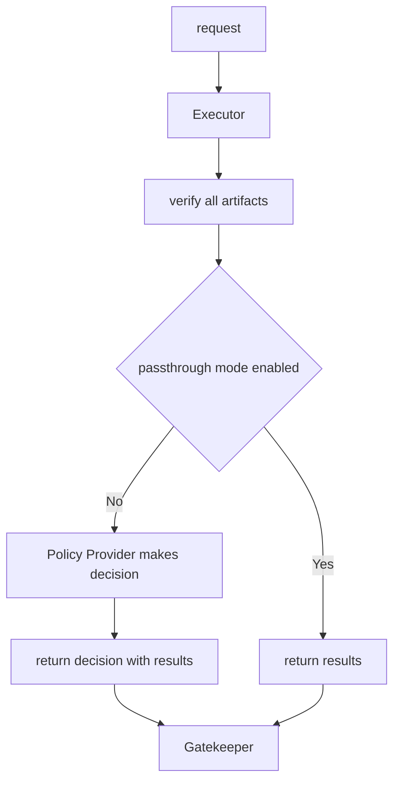

Config Policy Provider Refactor
===
Author: Binbin Li (@binbin-li)


# Introduction

Policy provider is an important component in Ratify execution. The current built-in policy provider is a configuration based provider which named as `configPolicy`. It supports the very basic use case that evaluates policies against given list of artifacts.

This primitive policy provider works well in the early stage of Ratify. However, the limitation on the policy evaluation prevented Ratify from supporting more features and resulted to some bugs at the same time.

We'd like to redesign the `configPolicy` provider to enhance the Ratify while addressing existing issues.


# Design Considerations
The new policy provider should cover but not limited to address these issues: [#351](https://github.com/ratify-project/ratify/issues/351), [#528](https://github.com/ratify-project/ratify/issues/528), [#448](https://github.com/ratify-project/ratify/issues/448), [35](https://github.com/ratify-project/ratify/issues/35)

## Targets
1. Avoid introducing breaking changes to existing interfaces.
2. Support evaluating multiple verifiers for the same artifact type.
3. Support nested verification.
4. Easy to support new use cases.
5. Support concurrent processing.
6. Bring back passthrough mode

## Use Cases
1. An image has multiple artifacts attached, it could be multiple notation signatures(multiple artifacts of the same type) or signatures of different types(artifacts of different types).
2. 2 different images require different policies even though they might have the same artifact graph.
3. One artifact is verified by multiple verifiers.
  a. They could be different verifier kinds, like notation-verifier and cosign-verifier.
  b. They could be the same verifier kinds, like multiple cosign-verifiers against keyless/keyed signatures.
4. Users want to specify a rule for each artifact in the graph.
5. Users want to specify a uniform rule for each artifactType.

# Architecture

## Current Architecture
The current `configPolicy` is pretty straightforward, which looks like:
```json
{
  "application/vnd.cncf.notary.signature": "any"
}
```

Ratify would iterate through artifacts and evaluate each based on the policy at the same time. The overall result will be returned with all verification results.

## New Architecture



The new `configPolicy` would be converted to a policy in Rego which is used for making decisions based on verification results. This policy can be used by both Ratify and Gatekeeper since they're evaluating the same verification results in fact.

To support nested verification, firstly we need to have a limit on the nested depth to avoid unlimited verifications. To save the computing resources, we could even add a limit on total number of verification happened for each image.

Secondly Ratify should be able to recoginize the nested artifactType structure. There could be 2 options accomplishing this goal.

1. Ratify just verifies all artifacts along the nested path, offloads the decision to OPA with verification results returned. It doesn't require executor have knowledge on the artifact graph but requires Ratify go through all artifacts and configured verifiers even though some of them are unnecessary.
3. Add a config to Ratify, probably an Executor Config. It specifies the allowed artifactTypes at each layer for given registries. For artifactTypes not specified in the config, Ratify will skip verification on them. This option requires an additional config besides the Rego policy config but saves resources used for the verification workflow.

Executor Config Example:
```json
[
  {
    "registryScopes": [ "*" ],
    "artifactTypes": [
      {
        "artifactType": "application/vnd.dev.cosign.artifact.sig.v1+json"
      },
      {
        "artifactType": "org.example.sbom.v0",
        "artifactTypes": [
          {
            "artifactType": "application/vnd.cncf.notary.signature",
          }
        ]
      }
    ],
  },
  {
    "registryScopes": [
      "registry.acme-rockets.io/software/net-monitor",
      "registry.acme-rockets.io/software/net-logger"
    ],
    "artifactTypes": [
      {
        "artifactType": "application/vnd.dev.cosign.artifact.sig.v1+json"
      }
    ],
  }
]
```


# Detailed Design

## Execution Mode

We used to support passthrough mode which was removed recently as it didn't make a real change to the validation behavior. As the new policy is getting more complicated, we're considering to integrate OPA as the policy engine, which makes it possible to support the passthrough mode in a natural way.

If the passthrough mode is enabled, Ratify would only return verification results from all verifiers against corresponding artifacts. Gatekeeper will make decisions based on the user-provided policy.

And if the passthrough mode is disabled, Ratify would make the decision via embeded OPA library. Then Ratify returns the decision along with the verification results to Gatekeeper.

## Verification Results

An example verification result for a single image:
```json
{
  "isSuccess": true,
  "verifierReports": [
    {
      "artifactType": "application/vnd.dev.cosign.artifact.sig.v1+json",
      "referenceDigest": "test.azurecr.io/test/hello-world@sha256:11111", # TBD
      "subject": "test.azurecr.io/test/hello-world:v1",
      "verifierReports": [
        {
          "verifierName": "cosign1",
          "verifierType": "verifier-cosign", # TBD
          "isSuccess": true,
          "message": "",
          "extensions": {}
        },
        {
          "verifierName": "cosign2",
          "verfierType": "verifier-cosign",
          "isSuccess": false,
          "message": "error msg",
          "extensions": {}
        }
      ],
      "nestedReports": []
    },
    {
      "artifactType": "org.example.sbom.v0",
      "subject": "test.azurecr.io/test/hello-world:v1",
      "referenceDigest": "test.azurecr.io/test/hello-world@sha256:22222",
      "verifierReports": [
        {
          "verifierName": "sbom",
          "verifierType": "sbom-verifier",
          "isSuccess": false,
          "message": "error msg",
          "extensions": {}
        },
        {
          "verifierName": "schemavalidator",
          "verifierType": "verifier-schemavalidator",
          "isSuccess": true,
          "message": "",
          "extensions": {}
        }
      ],
      "nestedReports": [
        {
          "artifactType": "application/vnd.cncf.notary.signature",
          "subject": "test.azurecr.io/test/hello-world@sha256:123",
          "referenceDigest": "test.azurecr.io/test/hello-world@sha256:33333",
          "verifierReports": [
            {
              "verifierName": "notaryv2",
              "verifierType": "verifier-notary",
              "isSuccess": true,
              "message": "",
              "extensions": {
                "Issuer": "testIssuer",
                "SN": "testSN"
              }
            }
          ],
          "nestedReports": []
        }
      ]
    }
  ]
}


```
The new report are very similar to the original one. But there are some key differences:
1. Old workflow only supports one verifier of the same type. Since it supports multiple verifiers now, the `verifierReports` fields will include reports from all qualified verifiers where each report introduces a `verifierType` field.
2. Move `artifactType` and `subject` out of `verifierReport` as they're shared for the same artifact.
3. The `isSuccess` only stands for the result for each verifier, it's not based on any policy now.
4. Add a `referenceDigest` to each artifact to distinguish between artifacts of the same type. But it's to be determined, we can also add it to the `extensions` field.
5. The `extensions` field could add any related info to be extended to support results not following the given format.
6. The `IsSuccess` field resides only at the root level which stands for the overall result of the verification when `passthrough` mode disabled.


## Rego Policy
Take the above verification results as an example, we'll give some Rego policy examples.

Example policy constraint template that enforces all verifier results succeeded.

```yaml
apiVersion: templates.gatekeeper.sh/v1beta1
kind: ConstraintTemplate
metadata:
  name: ratifyallvalidartifacts
spec:
  crd:
    spec:
      names:
        kind: RatifyAllValidArtifacts
  targets:
    - target: admission.k8s.gatekeeper.sh
      rego: |
        package ratifyallvalidartifacts

        import data.lib.image_verifier.failed_verify
        
        # Get data from Ratify
        remote_data := response {
          images := [img | img = input.review.object.spec.containers[_].image]
          response := external_data({"provider": "ratify-provider", "keys": images})
        }

        # Base Gatekeeper violation
        violation[{"msg": msg}] {
          general_violation[{"result": msg}]
        }
        
        # Check if there are any system errors
        general_violation[{"result": result}] {
          err := remote_data.system_error
          err != ""
          result := sprintf("System error calling external data provider: %s", [err])
        }
        
        # Check if there are errors for any of the images
        general_violation[{"result": result}] {
          count(remote_data.errors) > 0
          result := sprintf("Error validating one or more images: %s", remote_data.errors)
        }
        
        # Check if the success criteria is true
        general_violation[{"result": result}] {
          subject_validation := remote_data.responses[_]
          failed_verify(subject_validation[1].nestedReports)
          result := sprintf("Failed to verify the artifact: %s", [subject_validation[0]])
        }
      libs:
        - |
          package lib.image_verifier

          # Check if any report is false
          failed_verify(reports) {
            [path, value] := walk(reports)
            value == false
            path[count(path) - 1] == "isSuccess"
          }
```

Example policy that enforces：
1. At least one artifact per artifactType is verified for each subject.
2. At least one verifier per verifierType passes for each artifact.


```yaml
apiVersion: templates.gatekeeper.sh/v1beta1
kind: ConstraintTemplate
metadata:
  name: ratifyallvalidartifacts
spec:
  crd:
    spec:
      names:
        kind: RatifyAllValidArtifacts
  targets:
    - target: admission.k8s.gatekeeper.sh
      rego: |
        package ratifyallvalidartifacts

        import data.lib.image_verifier.failed_verify
        
        # Get data from Ratify
        remote_data := response {
          images := [img | img = input.review.object.spec.containers[_].image]
          response := external_data({"provider": "ratify-provider", "keys": images})
        }

        # Base Gatekeeper violation
        violation[{"msg": msg}] {
          general_violation[{"result": msg}]
        }
        
        # Check if there are any system errors
        general_violation[{"result": result}] {
          err := remote_data.system_error
          err != ""
          result := sprintf("System error calling external data provider: %s", [err])
        }
        
        # Check if there are errors for any of the images
        general_violation[{"result": result}] {
          count(remote_data.errors) > 0
          result := sprintf("Error validating one or more images: %s", remote_data.errors)
        }
        
        # Check if the success criteria is true
        general_violation[{"result": result}] {
          subject_validation := remote_data.responses[_]
          failed_verify(subject_validation[1].nestedReports)
          result := sprintf("Failed to verify the artifact: %s", [subject_validation[0]])
        }
      libs:
        - |
          package lib.image_verifier

          # Check if any report is false
          failed_verify(reports) {
            [path, value] := walk(reports)
            value == false
            path[count(path) - 1] == "isSuccess"
          }


apiVersion: templates.gatekeeper.sh/v1beta1
kind: ConstraintTemplate
metadata:
  name: ratifyallvalidartifacttypes
spec:
  crd:
    spec:
      names:
        kind: RatifyAllValidArtifactTypes
  targets:
    - target: admission.k8s.gatekeeper.sh
      rego: |
        package ratifyallvalidartifacttypes
        
        import data.lib.image_verifier.failed_verify

        # Get data from Ratify
        remote_data := response {
          images := [img | img = input.review.object.spec.containers[_].image]
          response := external_data({"provider": "ratify-provider", "keys": images})
        }

        # Base Gatekeeper violation
        violation[{"msg": msg}] {
          general_violation[{"result": msg}]
        }
        
        # Check if there are any system errors
        ge2neral_violation[{"result": result}] {
          err := remote_data.system_error
          err != ""
          result := sprintf("System error calling external data provider: %s", [err])
        }
        
        # Check if there are errors for any of the images
        general_violation[{"result": result}] {
          count(remote_data.errors) > 0
          result := sprintf("Error validating one or more images: %s", remote_data.errors)
        }
        
        # Check if the success criteria is true
        general_violation[{"result": result}] {
          subject_validation := remote_data.responses[_]
          failed_verify(subject_validate[1])
          result := sprintf("Failed to verify the artifact: %s", [subject_validation[0]])
        }
      libs:
        - |
          package lib.image_verifier

          failed_verify(reports) {
            [path, val] := walk(reports)
            path[count(path) - 1] == "nestedReports"
            not valid_reports(val)
          }

          # check if each artifactType has a valid artifact
          valid_reports(reports) {
            artifact_type_count := count_artifact_type(reports)
            valid_artifact_type_count := count_valid_artifact_type(reports)
            artifact_type_count == valid_artifact_type_count
          }

          count_artifact_type(nestedReports) = number {
            types := { type | type := nestedReports[_].artifactType}
            number := count(types)
          }

          count_valid_artifact_type(nestedReports) = number {
            types := { type | 
              type := nestedReports[i].artifactType
              verify_at_least_one_verfier_type_pass(nestedReports[i].verifierReports)
            }
            number := count(types)
          }

          # check if at least one verifier of each type passed verification
          verify_at_least_one_verfier_type_pass(reports) {
            verifier_type_count := count_verifier_type(reports)
            successful_verification_count := count_successful_verification(reports)
            verifier_type_count == successful_verification_count
          }

          count_verifier_type(reports) = number {
            types := { type | type := reports[_].verifierType}
            number := count(types)
          }

          count_successful_verification(reports) = number {
            types := { type | type := reports[_].verifierType; reports[_].isSuccess }
            number := count(types)
          }
```

Example policy that enforces：
1. At least one artifact is verified for each subject.
2. At least one verifier per verifierType passes for each artifact.

```yaml
apiVersion: templates.gatekeeper.sh/v1beta1
kind: ConstraintTemplate
metadata:
  name: ratifyanyvalidartifact
spec:
  crd:
    spec:
      names:
        kind: RatifyAnyValidArtifact
  targets:
    - target: admission.k8s.gatekeeper.sh
      rego: |
        package ratifyanyvalidartifact
        
        import data.lib.image_verifier.failed_verify

        # Get data from Ratify
        remote_data := response {
          images := [img | img = input.review.object.spec.containers[_].image]
          response := external_data({"provider": "ratify-provider", "keys": images})
        }

        # Base Gatekeeper violation
        violation[{"msg": msg}] {
          general_violation[{"result": msg}]
        }
        
        # Check if there are any system errors
        ge2neral_violation[{"result": result}] {
          err := remote_data.system_error
          err != ""
          result := sprintf("System error calling external data provider: %s", [err])
        }
        
        # Check if there are errors for any of the images
        general_violation[{"result": result}] {
          count(remote_data.errors) > 0
          result := sprintf("Error validating one or more images: %s", remote_data.errors)
        }
        
        # Check if the success criteria is true
        general_violation[{"result": result}] {
          subject_validation := remote_data.responses[_]
          failed_verify(subject_validate[1])
          result := sprintf("Failed to verify the artifact: %s", [subject_validation[0]])
        }

        # check if there is an invalid subject
        failed_verify(reports) {
          [path, val] := walk(reports)
          path[count(path) - 1] == "nestedReports"
          not is_valid_artifact(val)
        }

        # an empty nestedReports implies a valid subject
        is_valid_subject(reports) {
          count(reports) == 0
        }

        # a valid subject should have at least one valid artifact
        is_valid_subject(reports) {
          verify_at_least_one_verfier_type_pass(reports[_].verifierReports)
        }

        # check if at least one verifier of each type passed verification
        verify_at_least_one_verfier_type_pass(reports) {
          verifier_type_count := count_verifier_type(reports)
          successful_verification_count := count_successful_verification(reports)
          verifier_type_count == successful_verification_count
        }

        count_verifier_type(reports) = number {
          types := { type | type := reports[_].verifierType}
          number := count(types)
        }

        count_successful_verification(reports) = number {
          types := { type | type := reports[_].verifierType; reports[_].isSuccess }
          number := count(types)
        }
```

## Policy Enforcement

Since we're offloading decisions to OPA engine, the exisiting ConfigPolicy implementation does not fit new use case anymore. We have to update the `ConfigPolicy` implementation to support the new policy evaluation workflow and minimize changes to `PolicyProvider` interface.

- `VerifyNeeded()`: There is no change to this API. But if we do not adopt Executor Config and let Ratify just verify all artifacts, then this API could be deprecated.
- `ContinueVerifyOnFailure()`: This api is no longer needed as Executor only evaluates the overall result after all artifacts are verified.
- `ErrorToVerifyResult()`: No change to this API.
- `OverallVerifyResult()`: The implementation should be updated to use OPA libarary for making decisions.


# Explanation

1. There is an assumption behind the fact that the new config policy is much more complicated. As cluster operator, users should know what types of artifacts will be available as well as the expected basic artifact tree or relationship structure.
2. The new design introduces Rego language into the Ratify Policy. On the one hand, it makes the policy interchangeable between Ratify and Gatekeeper and leaves all policy evaluation work to OPA engine. On the other hand, it requires users learn Rego language to add new policies. And since Ratify makes the decision after all verification is done, it requires more computing resources without ability to fail early.
3. To be backward compatible, we could let both old and new policies coexist before cutting stable release. We could rename the Rego Policy which dominates the previous Json Policy. Then users could use both polices, Ratify will pick the provided one. If both of them are given, the Rego one is adopted. However, the response to GK ED request has to be updated as verification results changed.


# Work Item Breakdown
## Work Items
1. [TBD] Add VerifierType to Verifier CRD and Verifier interface so that reports can add VerifierType field.
1. New policy evaluation workflow that uses OPA libarary to make decisions based on verification results and given policy.
2. [TBD] Add executor config specifying artifact graph. Update the executor worklow to follow the artifact graph. 
4. New controller fetches Rego policies from constraint template CRD.
5. Add passthrough mode support.

# Open questions
1. Should `maxNestedDepth` and `maxVerificationCount` have a fixed limit in Ratify or be adjustable by users' settings?
2. Per Susan's concern on the max size of the response, I didn't find a size limit provided by Gatekeeper, so I assume there is no techinial limit on it.

# Future Work
1. Currently verifier config could include `nestedReferences` indicating a nested relationship. e.g.
    ```
    {
        "name": "sbom",
        "artifactTypes": "org.example.sbom.v0",
        "nestedReferences": "application/vnd.cncf.notary.signature"
    }
    ```
    In the future, we might remove this field or combine it to the policy.

2. Since an artifact can be verified by multiple verifiers of the same type, we might add new rules to filter results from desired verifiers instead of any/all of them which could be handled by Rego Policy.

