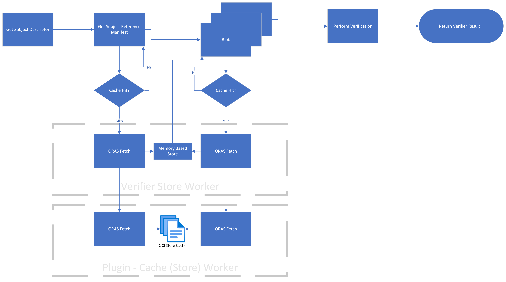

# OCI Store Index Race Condition and Cache Worker

## Problem Statement

Tracked issues in scope:
<https://github.com/ratify-project/ratify/issues/1110>

ORAS referrer store can fail to initialize for external verifiers with error:

```log
Original Error:(Original Error: (create store from input config failed with error Original Error: (invalid OCI Image Index: failed to decode index file: EOF), Error: plugin init failure, Code: PLUGIN_INIT_FAILURE, Component Type: referrerStore, Detail: could not create local ORAS cache at path: /home/runner/.ratify/local_oras_cache))
```

This occurs when multiple external verifiers are executed for the same subject in parallel.
Intermittent issue affecting e2e tests

```json
{
  "verifierReports": [
    {
      "subject": "localhost:5000/all:v0",
      "isSuccess": true,
      "name": "notation",
      "message": "signature verification success",
      "extensions": {
        "Issuer": "CN=ratify-bats-test,O=Notary,L=Seattle,ST=WA,C=US",
        "SN": "CN=ratify-bats-test,O=Notary,L=Seattle,ST=WA,C=US"
      },
      "artifactType": "application/vnd.cncf.notary.signature"
    },
    {
      "isSuccess": false,
      "name": "cosign",
      "message": "Original Error: (Original Error: (create store from input config failed with error Original Error: (invalid OCI Image Index: failed to decode index file: EOF), Error: plugin init failure, Code: PLUGIN_INIT_FAILURE, Component Type: referrerStore, Detail: could not create local oras cache at path: /home/runner/.ratify/local_oras_cache), Error: verify signature failure, Code: VERIFY_SIGNATURE_FAILURE, Plugin Name: cosign, Component Type: verifier), Error: verify reference failure, Code: VERIFY_REFERENCE_FAILURE, Plugin Name: cosign, Component Type: verifier",
      "artifactType": "application/vnd.dev.cosign.artifact.sig.v1+json"
    },
    {
      "subject": "localhost:5000/all:v0",
      "isSuccess": true,
      "name": "licensechecker",
      "message": "License Check: SUCCESS. All packages have allowed licenses",
      "artifactType": "application/vnd.ratify.spdx.v0"
    },
    {
      "subject": "localhost:5000/all:v0",
      "isSuccess": true,
      "name": "schemavalidator",
      "message": "schema validation passed for configured media types",
      "artifactType": "vnd.aquasecurity.trivy.report.sarif.v1"
    },
    {
      "isSuccess": false,
      "name": "sbom",
      "message": "Original Error: (Original Error: (create store from input config failed with error Original Error: (invalid OCI Image Index: failed to decode index file: EOF), Error: plugin init failure, Code: PLUGIN_INIT_FAILURE, Component Type: referrerStore, Detail: could not create local oras cache at path: /home/runner/.ratify/local_oras_cache), Error: verify signature failure, Code: VERIFY_SIGNATURE_FAILURE, Plugin Name: sbom, Component Type: verifier), Error: verify reference failure, Code: VERIFY_REFERENCE_FAILURE, Plugin Name: sbom, Component Type: verifier",
      "nestedResults": [
        {
          "subject": "localhost:5000/all@sha256:b71c1f874fbc92173278bcb7bb44c785b167f7efa3c44b52eb48e20d540741b5",
          "isSuccess": true,
          "name": "notation",
          "message": "signature verification success",
          "extensions": {
            "Issuer": "CN=ratify-bats-test,O=Notary,L=Seattle,ST=WA,C=US",
            "SN": "CN=ratify-bats-test,O=Notary,L=Seattle,ST=WA,C=US"
          },
          "artifactType": "application/vnd.cncf.notary.signature"
        }
      ],
      "artifactType": "org.example.sbom.v0"
    }
  ]
}
```

## Proposed Solution

- Remove ORAS `Push` operation, whose target is OCI store, from verifier. Resolve OCI Store race condition in multi-verifier scenarios.
- Using shared memory to implement a queue for ORAS `Push`. Manage ORAS concurrency tasks.

## User Scenarios

### Using verifier of different types and different versions of same verifier

When multiple verifiers are executed for the same artifiact can cause the racing condition issue.
With the proposed solution, ORAS `Push` mentioned is only handled by cache worker.

### Reusing OCI artifacts

The cache is very important when using the verifier to verify the same subject.

## Data Flow




## Component Description

- Cache Provider: Set up to cache data for `GetSubjectDescriptor`, `ListReferrers`.

- OCI Store(local cache): A content store based on file system with the OCI-Image layout.
  - Both executor and plugin initiation would `CreateStoresFromConfig`, add cache check can help avoid duplication.
  - task handler is event driven controlled by cache worker: new enqueue item created, last task finished
  - a write lock is set in Cache Provider to avoid conflict
  - a read lock/availability map is set for the writing content to avoid dirty read

- Cache (Store) Worker: A Store related operations handler.
  - Manage memory backed content store
  - Enqueue task in cache provider to write into OCI Store
  - Check read lock/availability map in cache provider to avoid dirty read

```golang

type CacheWorker interface {

    // CreateMemoryOCIStore creates memory based OCI Store
    CreateMemoryOCIStore() error

    // GetAvailableOCIStore returns current OCI layout based OCI Store if exists
    GetAvailableOCIStore() (*orasStore, error)

    // GetBlobContent returns the blob with the given digest
    // WARNING: This API is intended to use for small objects like signatures, SBoMs
    GetBlobContent(ctx context.Context, subjectReference common.Reference, digest digest.Digest) ([]byte, error)

    // GetReferenceManifest returns the reference artifact manifest as given by the descriptor
    GetReferenceManifest(ctx context.Context, subjectReference common.Reference, referenceDesc ocispecs.ReferenceDescriptor) (ocispecs.ReferenceManifest, error)

    // GetCachedResource checks read lock from cache provider and returns data cached in OCI layout based OCIStore
    GetCachedResource() error

    // EnqueueCacheTask adds caching task into message queue in Cache Provider
    EnqueueCacheTask() error

    // DequeueCacheTask handle the up-coming caching task
    // checks write lock, availability map of resource
    DequeueCacheTask() error

    // CacheBlobContent cached target blob content into OCI layout based OCI Store
    CacheBlobContent(ctx context.Context, subjectReference common.Reference, digest digest.Digest) error

    // CacheReferenceManifest cached target manifest into OCI layout based OCI Store
    CacheReferenceManifest(ctx context.Context, subjectReference common.Reference, referenceDesc ocispecs.ReferenceDescriptor) error
}

```

## Alternative Considers and Comparisons

### Async Caching VS Sync Caching

Async Caching(with queue)
1. Queue is helpful in efficient task handling, scalability, and fault tolerance which are critical requirements.

Sync Caching
1. Sync write to OCIStore leads to racing condition. Using lock would naturally heads to more waiting in line.
2. When doing sync write, both read write racing condition have be handled in verifier process which increase the complexity. When doing async write, those jobs are delegated to **Cache Provider**.


### One Store for All verifiers VS One Store per Verifier

One Store for All verifiers
1. Systems should be kept as simple as possible. Complexity should only be added where absolutely necessary.
2. Easy for monitoring and gain insights into its behavior and performance
3. Systems can scale out horizontally to handle increased load with no breaking change.

One Store per Verifier
1. Syncing in between those OCI stores will cause design difficulty.
2. If if OCI stores are verifer-binded, when the verifier is recycled the OCI stores is gone. Otherwise another resource maintainer(provider) is needed.
3. Maintaining multi-OCIStores means extra memory cost

## Supported Limits and Further Considerations

In Ristretto using scenario, do we support multi-notation verifier, in other words do we have to support cache worker with Ristretto

Message queue handling is event driven: when ever enqueue, dequeue finished cache worker should start trying dequeuing a new task

## Appendices

- [Multi-tenancy](https://ratify.dev/docs/reference/multi-tenancy)
- [Image Integrity](https://learn.microsoft.com/en-us/azure/aks/image-integrity?tabs=azure-cli#how-image-integrity-works)