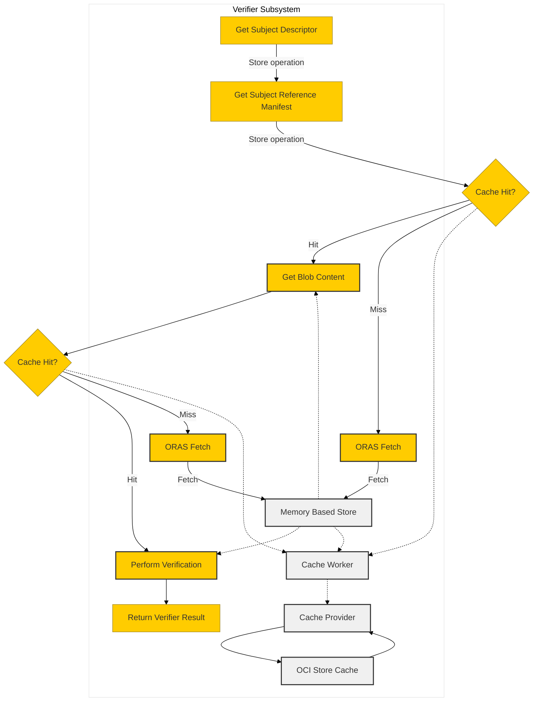

# OCI Store Index Race Condition

## Purpose
Resolve OCI Store race condition in multi-verifier scenarios

## Table of Content
- Data Flow
- Component Description
- User Scenarios
- Performance
- Supported Limits
- Appendices

### Data Flow

### Component Description
- Cache Provider: Set up to cache data for `GetSubjectDescriptor`, `GetReferenceManifest`.

- OCI Store(local cache): A content store based on file system with the OCI-Image layout.
  - Both executor and plugin initiation would `CreateStoresFromConfig`, add cache check can help avoid duplication.

- Cache Worker: 
  - Manage memory backed content store
  - Enqueue task in cache provider to write into OCI Store
  - Check read lock in cache provider to avoid dirty read

### User Scenarios
1. Using different version of same verifier

2. Multi-tenancy

### Performance

### Supported Limits

### Appendices
