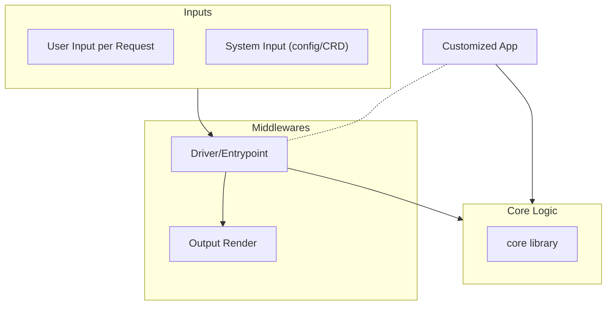
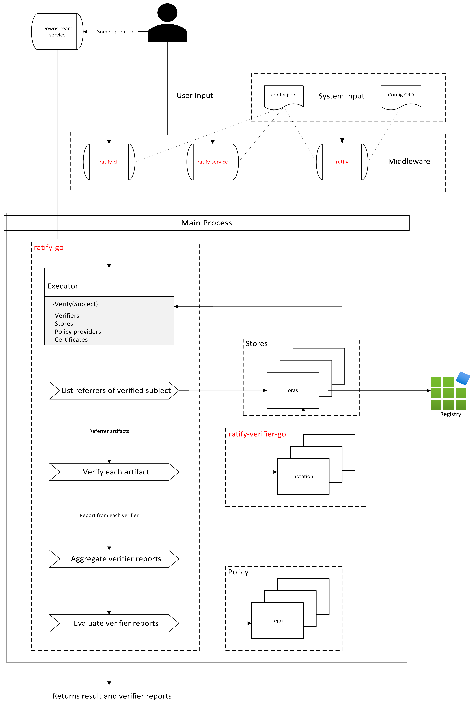

Ratify v2 Architecture Proposal
===============================
Author: Binbin Li

## Table of Contents
- [Ratify v2 Architecture Proposal](#ratify-v2-architecture-proposal)
  - [Table of Contents](#table-of-contents)
  - [Background](#background)
  - [Previous Discussions](#previous-discussions)
  - [Goals](#goals)
  - [Current Architecture of Ratify v1](#current-architecture-of-ratify-v1)
    - [Limitations](#limitations)
  - [Proposed Architecture of Ratify v2](#proposed-architecture-of-ratify-v2)
    - [High Level Design](#high-level-design)
      - [Architecture Components](#architecture-components)
    - [Design Details](#design-details)
      - [Design considerations](#design-considerations)
      - [Plugin Framework](#plugin-framework)
        - [Difference between v1 and v2](#difference-between-v1-and-v2)
        - [Example](#example)
    - [Proposed Repository Layout](#proposed-repository-layout)
    - [Proposed Milestones](#proposed-milestones)
    - [Q\&A](#qa)

## Background
Ratify has reached its first major release in over a year and has been widely adopted by users at scale. However, there are some know limitations in the current design and implementations of Ratify v1 that make it difficult to support more user scenarios/new features and enhance performance. These constraints make it challenging to attract more users and contributors. This is a proposal to address these limitations and improve the overall architecture of Ratify in the next major release, Ratify v2.

## Previous Discussions
In a previous [discussion](https://github.com/ratify-project/ratify/pull/1905), we have identified some areas that need to be improved in Ratify v2, which includes but not limited to: system refactoring, deprecations, document update and unit test improvement. This proposal will focus on the system refactoring part, specifically the overall architecture of Ratify v2 including new plugin framework and decoupling of core components.

## Goals
The goal of this proposal aligns with the goal in the previous discussion, specifically:
1. Refactor the code to make it more modular and maintainable.
2. Improve the performance of Ratify by optimizing the core components and making it easier to scale.
3. Reduce the dependencies of Ratify so that it is easier to maintain and upgrade.
4. Make it easier for contributors to develop and test new features.

## Current Architecture of Ratify v1


### Limitations
1. Ratify only supports CLI and K8s scenarios. But actually current Ratify is only well implemented/designed for K8s scenarios. There are some feature gaps between CLI and K8s implementations. To support more scenarios, like containerd plugins or docker plugins, or just a library for downstream services, we need to make Ratify to be more extensible.
2. Ratify was designed to validate security metadata of any given artifacts. But right now Ratify is mainly focusing on the K8s scenarios with images being verified.
3. The plugin framework was designed to separate built-in and external plugins. Built-in plugins run in the same process of Ratify while each external plugin would be executed in a new subprocess. Therefore, external plugins cannot share the in-memory cache with the main process, which may result to performance degradation, data inconsistency, race condition and security vulnerabilities.
4. The built-in plugins and authentication for different cloud providers are part of the main Ratify repository, which introduces a significant number of dependencies. This issue will become even more pronounced as additional cloud provider and new plugin implementation are added in the future.
5. Even though the current executor has been optimized for performance, it will be a bottleneck when the number of security artifacts increased significantly.
6. The configuration applied in CLI and K8s scenarios are not exactly same, which makes it difficult for users to maintain and switch between different scenarios.

## Proposed Architecture of Ratify v2

### High Level Design


#### Architecture Components
1. **Core Logic**: The core logic of Ratify v2 will be implemented as a separate library, which can be used by different scenarios. The core logic will be responsible for the validation of security metadata of any given artifacts. It will be designed to be extensible so that it can be easily integrated with different scenarios. And it will be optimized for performance and scalability.
2. **User Input per Request**: The user input is the validation request from the user to validate the security metadata of the artifacts. The user input will be handled by the driver/entrypoint and passed to the core logic for validation.
3. **System Input (config/CRD)**: The system input defines configurations of the Ratify application. It can be a configuration file or a custom resource definition (CRD) in Kubernetes. The system input can be configured during startup or runtime.
4. **Driver/Entrypoint**: The driver/entrypoint will be responsible for handling user input and system input, and invoking the core logic to validate the security metadata of the artifacts. It will also be responsible for invoking the output render to render the validation results. It will have different implementations in terms of the user scenario.
5. **Output Render**: The output render will be responsible for rendering the validation results.
6. **Middlewares**: The middleware consists of `Driver/Entrypoint` and `Output Render`. Each user scenario will have its own middleware implementation.
7. **Customized App**: The customized app can be any application behaves in a similar was as the middleware. It will be responsible for handling its own input and invoking the core logic to validate the security metadata of the artifacts and rendering its own output.

### Design Details
Below is a more detailed design of the proposed architecture of Ratify v2. Note that text in red indicates a repository under `ratify-project` organization.


#### Design considerations
1. Extract the Ratify core library(ratify-go) to focus solely on its primary functionality: validating the security metadata of artifacts in an efficient way. Consequently, the mutation API will be removed from the core library. The Ratify core will define required interfaces including Verifier, Store, and PolicyEnforcer but contains no implementation in the repo to minimize the dependencies in the core library. The core library should be designed to be highly scalable and performant. And it should be easy to integrate with different scenarios.
2. Move the Ratify CLI to a separate repository (ratify-cli) that uses the Ratify core library. `ratify` repo will keep serving for the K8s scenarios. For other entrypoint/usage scenarios, such as standalone service or github action, we can create separate repos for each in the future.
3. To implement different plugins for each interface, we can create monorepo for each interface(e.g. `ratify-verifier-go`). Therefore the dependencies from plugins would just reside in plugin repos. And since store and policyEnforcer interfaces have limited implementations and much less dependencies, we can keep them in the `ratify-go` repo for now and move out if necessary.
4. In the new plugin framework, oras store and verifiers will run in the same process as Ratify main process, which will improve the performance and security of Ratify. As part of the Oras store implementation, Oras store cache will be safely shared by all verifiers without race condition.
5. We already have a [design](https://github.com/ratify-project/ratify/pull/1940) for unifying the auth provider for Oras and KMP/Verifier. In ratify v2, ratify-go will define the auth provider interface. And implementations for different stores and cloud providers will reside in the entrypoint repos, e.g. `ratify-cli` and `ratify`.
6. Each entrypoint repo will own the responsibility to select appropriate plugin implementations to build the image or binaries. Through injecting the dependency at build time, entrypoint repos will NOT introduce new dependencies from those plugin implementations. Additionally, plugins will run in the same process as Ratify main process to achieve the best performance and security.
7. The configuration CRD needs to be redesigned to allow seamless conversion to config.json for other use cases.

#### Plugin Framework

##### Difference between v1 and v2
1. In v1, except for built-in verifiers, Ratify needs to build external verifiers and stores as separate binaries under `/plugins` directory during docker build. In v2, all verifiers and stores implementations are libraries that can be imported by the main application. The main application will select appropriate implementations based on the need during docker build time.
2. In v2, users don't need to build the plugins to binaries. For customized plugins, user can create a new repo and implement the interfaces defined in the core library. The main application will automatically register the plugins during docker build time if the plugins are imported in the main application.
3. In v1, verifiers are shipped with the main Ratify repo, therefore the Ratify version and verifier version are coupled. In v2, the core library only defines plugin interfaces and the plugin implementations are in separate repos. The version compatibility between the core library and plugin repos will be handled by `go mod tidy` based on semantic versioning. Users can use different versions of a specific plugin implementation as long as it's compatible with the core library.

##### Example
Below is an example of how the plugin framework can be implemented in Ratify v2.

In this example, the core library defines interfaces and Register functions for verifier/store plugins. Each plugin implementation will register itself with the core library during initialization. The Executor will use the registered plugins to validate the security metadata of the artifacts. The main application only has to import the core library, and the appropriate plugins will be automatically registered during docker build time.

```go
// core
type ReferrerStore interface {
	ListReferrers() string
}
type ReferenceVerifier interface {
	VerifyReference(store ReferrerStore) bool
}
type Executor struct {
	verifiers map[string]ReferenceVerifier
	stores    map[string]ReferrerStore
}
var verifierTypes map[string]ReferenceVerifier
var storeTypes map[string]ReferrerStore

func RegisterStore(name string, store ReferrerStore) {
	fmt.Printf("Registering store %s\n", name)
	if storeTypes == nil {
		storeTypes = make(map[string]ReferrerStore)
	}
	storeTypes[name] = store
}

func RegisterVerifier(name string, verifier ReferenceVerifier) {
	fmt.Printf("Registering verifier %s\n", name)
	if verifierTypes == nil {
		verifierTypes = make(map[string]ReferenceVerifier)
	}
	verifierTypes[name] = verifier
}

func (r *Executor) Verify() {
	r.verifiers["cosign"].VerifyReference(r.stores["oras"])
}

func NewExecutor() *Executor {
	return &Executor{
		verifiers: verifierTypes,
		stores:    storeTypes,
	}
}
/*----------------------------------------------------------*/
// notation verifier
type Verifier struct{}

func (v *Verifier) VerifyReference(store core.ReferrerStore) bool {
	fmt.Println("Notation verifier")
	fmt.Println(store.ListReferrers())
	return true
}

func init() {
	core.RegisterVerifier("notation", &Verifier{})
}
/*----------------------------------------------------------*/
// cosign verifier
type Verifier struct{}

func (v *Verifier) VerifyReference(store core.ReferrerStore) bool {
	fmt.Println("Cosign verifier")
	fmt.Println(store.ListReferrers())
	return true
}

func init() {
	core.RegisterVerifier("cosign", &Verifier{})
}

/*----------------------------------------------------------*/
// oras store
type Store struct{}

func (s *Store) ListReferrers() string {
	fmt.Println("oras")
	return "oras"
}

func init() {
	core.RegisterStore("oras", &Store{})
}

/*----------------------------------------------------------*/
// Ratify main application
package main

import (
	"github.com/binbin-li/ratify-test/core"
)

func main() {
	manager := core.NewExecutor()
	manager.Verify()
}
```
```Dockerfile
# Dockerfile
# Use the official Golang image as the base image
FROM golang:1.21-alpine

# Set the working directory inside the container
WORKDIR /app

# Copy the Go modules files
COPY go.mod ./

# Download the Go modules
# RUN go mod download

# Copy the source code
COPY . .

# Add appropriate verifier/store implementation
RUN sed -i '2i\import _ "github.com/binbin-li/ratify-test/cosign"' main.go && \
    sed -i '2i\import _ "github.com/binbin-li/ratify-test/notation"' main.go && \
    sed -i '2i\import _ "github.com/binbin-li/ratify-test/oras"' main.go

RUN go mod tidy

# Build the Go application
RUN go build -o main .

# Command to run the executable
CMD ["./main"]
```
In the above example, the only dependency of Ratify repo is the Ratify core library. And users could select appropriate interface implementations by adding `import _` lines in the Dockerfile.

For `ratify-cli` repo, we'll have a script to build the CLI binary. The script will behave like the Dockerfile in the above example to enable CLI implementation to select appropriate plugins.

For `ratify-cli` and `ratify` repos, we will ship one or a few images with default verifiers like Notation and Cosign to cover common user scenarios. Users can create their own images with customized plugins by adding `import _` lines in the Dockerfile or scripts.

### Proposed Repository Layout
- Keep the `ratify` repo for K8s scenario as an external data provider for Gatekeeper.
- `ratify-go` (serves as the Ratify core library)
- `ratify-verifier-go` (monorepo for different implementations of verifiers)
- [optional] `ratify-store-go` (monorepo for different implementations of stores)
- [optional] `ratify-policy-go` (monorepo for different implementations of policy enforcers)
- `ratify-cli` (for CLI user scenario)
- more repos for other user scenarios in the future.

### Proposed Milestones
- Alpha.1: Create and implement ratify core library(`ratify-go`)
- Alpha.2: Create v2 branch in ratify repo, switch the Executor to use the new Ratify core.
- Beta.1: Implement Oras store and Notation verifier
- Beta.2: Implement Oras store cache and Cosign verifier
- Beta.3: Implement the CLI entrypoint(`ratify-cli`)
- RC.1: Add missing features from ratify v1
- GA for Ratify v2 refactoring:
  - ratify: v2.0.0
  - ratify-go: v1.0.0
  - ratify-cli: v0.1.0 or v1.0.0 based on the priority
  - ratify-verifier-go:
    - Notation: v1.0.0
    - Cosign: v1.0.0

### Q&A
1. **Q**: How does the version compatibility between the core library and the plugin repos?
   
   **A**: Since core library and plugin repos are all imported by main application as direct dependencies, `go mod tidy` will ensure the highest compatible version of conflict dependency is used based on semantic versioning. Theoretically, the core library defines interfaces for the plugin implementation, as long as there is no breaking change in the interface, the plugin implementation don't need to bump up version along with the core library.
2. **Q**: Does the plugin framework support customized plugins in different languages?
   
   **A**: No.  The plugin framework is designed to support Go plugins only. If we need to support plugins in different languages, we need to find alternative solutions, like gRPC plugin, io.pipe or Wasm. Due to the performance and security concerns, we do not support those solutions in the early stage of Ratify v2, but probably will be added in the future as an extended feature.
3. **Q**: Are there any other options for the plugin framework? What's the reason to choose this one?
   
   **A**: There are a new options have been considered, like gRPC plugin([hashicorp/go-plugin](https://github.com/hashicorp/go-plugin)), plugin as [WASM binaries](https://github.com/knqyf263/go-plugin), or using an embedded Go interpreter([`raefik/yaegi](https://github.com/traefik/yaegi)). However, Ratify v2 is designed to be a lightweight and high performance tool, so we choose the simplest and most efficient way to implement the plugin framework. Those options will impact the performance, which is not the best choice for Ratify v2. And for the [golang plugin](https://pkg.go.dev/plugin) library, it will achieve good performance but has arch limitations and requires dependencies of the main application and plugins to be the same.
4. **Q**: How to handle the multi-tenancy in the new architecture?
   
   **A**: Since the core library only focuses on artifact validation, the multi-tenancy should be handled by the entrypoint, specifically the Gatekeeper add-on in the K8s scenario. The entrypoint should be responsible for handling the multi-tenancy or seeking for other solutions without multi-tenancy support from Ratify.