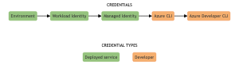

# **Azure Authentication Refactoring in Ratify**

## **Introduction**
Authentication is a critical process in Ratify, ensuring secure access to artifatcs in container registries, and to keys, secrets and certificates from cloud key vaults, and other resources. Azure offers two primary SDKs for authentication in Go:

- **Azure Identity ([azidentity](https://learn.microsoft.com/en-us/azure/developer/go/azure-sdk-authentication?tabs=bash))**: Designed for seamless integration with Azure services.
- **Microsoft Authentication Library ([MSAL](https://learn.microsoft.com/en-us/entra/identity-platform/msal-overview))**: Provides advanced token management capabilities.

Currently, Ratify uses both SDKs across different components, leading to complexity and maintenance overhead. This document proposes a comprehensive refactoring of Azure authentication in Ratify to improve maintainability, reduce duplication, and streamline the user experience.

---

## **Existing Azure Authentication in Ratify**

### **ACR Token Retrieval**
Located in the **ORAS auth providers (`pkg/common/oras/authprovider/azure`)**:
1. **Azure Managed Identity (`azureidentity.go`)**:
   - Uses `azidentity.NewManagedIdentityCredential` to retrieve an access token.
   - Requires only the `clientID`:
     ```go
     id := azidentity.ClientID(clientID)
     opts := azidentity.ManagedIdentityCredentialOptions{ID: id}
     cred, err := azidentity.NewManagedIdentityCredential(&opts)
     ```

2. **Azure Workload Identity (`azureworkloadidentity.go`)**:
   - Uses `confidential.NewCredFromAssertionCallback` from the **MSAL** package. 

### **Key Management Provider and Certificate Provider**
Both components recently replaced the deprecated `autorest` SDK with `azidentity` and now use workload identity credentials for authentication.

---

## **Challenges with the Current Design**

### 1. **Multiple SDKs**
Ratify employs both **`MSAL`** and **`azidentity`**, increasing the maintenance burden. Consolidating to a single SDK simplifies dependency management, reduces upgrade complexity, and enhances maintainability.

### 2. **Code Duplication**
Significant code duplication exists across components, particularly between Azure workload identity and managed identity implementations. Consolidating shared logic improves maintainability.

### 3. **Explicit Authentication Selection**
Currently, users must explicitly specify the authentication type. In well-defined environments like Azure Kubernetes Service (AKS), this should be inferred automatically based on environment variables.

---

## **Proposed Refactoring**

### **Goals**
1. Design a **common package** for Azure authentication logic.
2. **Infer authentication type** automatically based on the environment, reducing user configuration overhead.
3. **Unify implementations** for workload identity and managed identity in ORAS auth providers.
4. Implement a **chained authentication process**:
   - Workload Identity → Managed Identity → Azure CLI.
5. Use a single SDK (**`azidentity`**) for all authentication workflows to improve maintainability and alignment with Azure best practices.

---

### **Refactoring Plan**

#### **1. Introduce a New Azure Authentication Package**
- A new package, `pkg/common/cloudauthproviders/azure`, will consolidate shared Azure authentication logic.
- Authentication will use `ChainedTokenCredential` to sequentially try:
  - **Workload Identity**
  - **Managed Identity**
  - **Azure CLI**
- If all attempts fail, the process will return an error.

##### **Proposed Code Snippet**
```go
package azure

import (
	"fmt"
	"os"

	"github.com/Azure/azure-sdk-for-go/sdk/azidentity"
)

func NewChainedCredential() (*azidentity.ChainedTokenCredential, error) {
	var creds []azidentity.TokenCredential

	// Add Workload Identity if environment variables are set
	if tenantID := os.Getenv("AZURE_TENANT_ID"); tenantID != "" {
		if clientID := os.Getenv("AZURE_CLIENT_ID"); clientID != "" {
			if tokenFile := os.Getenv("AZURE_FEDERATED_TOKEN_FILE"); tokenFile != "" {
				wiCred, err := azidentity.NewWorkloadIdentityCredential(&azidentity.WorkloadIdentityCredentialOptions{
					TenantID:      tenantID,
					ClientID:      clientID,
					TokenFilePath: tokenFile,
				})
				if err == nil {
					creds = append(creds, wiCred)
				}
			}
		}
	}

	// Add Managed Identity
	if clientID := os.Getenv("AZURE_CLIENT_ID"); clientID != "" {
		miCred, err := azidentity.NewManagedIdentityCredential(&azidentity.ManagedIdentityCredentialOptions{
			ID: azidentity.ClientID(clientID),
		})
		if err == nil {
			creds = append(creds, miCred)
		}
	}

	// Add Azure CLI Credential
	cliCred, err := azidentity.NewAzureCLICredential(nil)
	if err == nil {
		creds = append(creds, cliCred)
	}

	if len(creds) == 0 {
		return nil, fmt.Errorf("no valid credentials detected. Check environment configuration.")
	}

	// Combine credentials into a chain
	return azidentity.NewChainedTokenCredential(creds, nil)
}
```

In the code sample above, the chained token credential will try to authenticate using workload identity first, then managed identity will be attempeted, and then the CLI authentication will be attempted. If any of the attempts succeed at any stage, it will return the corresponding credential. 

There is another option that can be used which is the default azure credential: `azidentity.NewDefaultAzureCredential`. It's an opinionated, preconfigured chain of credentials and is designed to support many environments, along with the most common authentication flows and developer tools. In graphical form, the underlying chain looks like this:


Howecer, this option is not recommended for the following reasons:
1. Debugging challenges: When authentication fails, it can be challenging to debug and identify the offending credential. You must enable logging to see the progression from one credential to the next and the success/failure status of each. In contrast, [debugging a chained credential](https://www.rfc-editor.org/rfc/rfc3280#section-1) is relatively easy.
2. Unpredictable behavior: DefaultAzureCredential checks for the presence of certain environment variables. It's possible that someone could add or modify these environment variables at the system level on the host machine. Those changes apply globally and therefore alter the behavior of DefaultAzureCredential at runtime in any app running on that machine.
3. Ability to provide required parameters: When using the default azure credential option, we can only rely on the environment variables, meaning that we cannot provide the client_id, tenant_id, or any other parameter explicitly. This is particularly problematic when Ratify is provided with multiple auth providers. With the chanined token credentials, each credential type in the chain can be provided with the required parameters explicitly if needed.

#### **2. Refactor ORAS Auth Providers**
- Combine `azureidentity.go` and `azureworkloadidentity.go` into a single file.
- Update the implementation to use the `pkg/common/cloudauthproviders/azure` package for authentication.
- Authentication type will be inferred based on environment variables.

#### **3. Refactor Key Management and Certificate Providers**
- Update the providers to leverage the new `pkg/common/cloudauthproviders/azure` package for authentication.
- Remove redundant logic and ensure consistent authentication processes across all providers.

#### **4. Configuration change**
- Introduce a new generic auth provider: `azure`
. A sample Oras store config has a section for auth provider that looks like this:
```
authProvider:
    name: azureWorkloadIdentity
    clientID: XYZ
```
We will introduce a new authProvider: `name: azure`. This will let Ratify know that it should use the chained token credential. We can provide the required parameters explicitly like `clientId` and `tenantID` as well, and this will let the chain token credential know that it will need to use these parameters instead of the environment variables. For backward compatibility, we will also provide the ability to override the chained token credential implementation by specifying additional attribute named `credential` which can be set to either `managedIdentity`, `workloadIdentity`, or `cli`. This will trigger the specified credential option instead of the chanined token credential.


---

### **Advantages of the Proposed Refactoring**

1. **Improved Maintainability**:
   - A single SDK (`azidentity`) reduces dependencies and simplifies code management.
   - Consolidated authentication logic minimizes duplication and enhances clarity.

2. **Enhanced User Experience**:
   - Automatic detection of authentication type eliminates the need for explicit configuration in most environments.

3. **Extensibility**:
   - Centralized authentication logic makes it easier to extend support for new scenarios or credential types in the future.

4. **Alignment with Azure Best Practices**:
   - `azidentity` provides a Kubernetes-native experience, integrating seamlessly with other Azure SDKs.

---

### **Proposed Tasks**

1. **Create the New Azure Authentication Package**:
   - Implement shared authentication logic using `azidentity` and `ChainedTokenCredential`.

2. **Refactor ORAS Auth Providers**:
   - Combine `azureidentity.go` and `azureworkloadidentity.go`.
   - Use the new package for authentication.

3. **Refactor Key Management and Certificate Providers**:
   - Update the providers to leverage the common Azure authentication package.

4. **Test and Validate**:
   - Thoroughly test the refactored components across different environments (e.g., AKS, local development) to ensure correctness and reliability.

