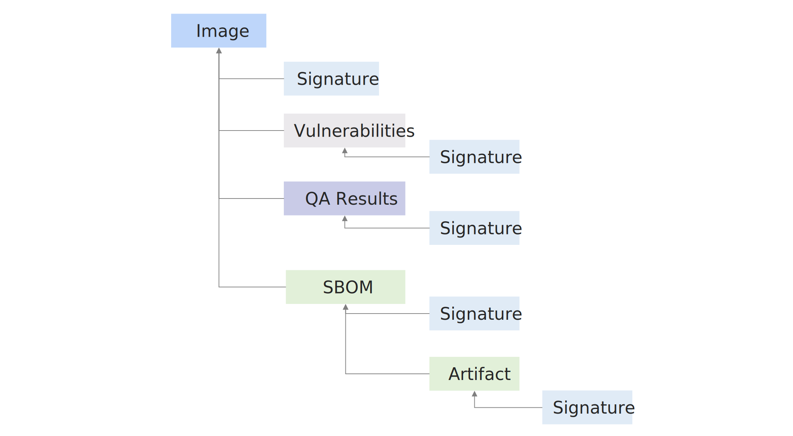

# Framework Overview

This specification outlines a workflow of artifact verification which can be utilized by artifact consumers and provides a framework for the Notary project to be consumed by clients that consume these artifacts. The RATIFY framework enables composition of various verifiers and referrer stores to build verification framework into projects like GateKeeper. This framework serves as an orchestrator of various verifiers that are coordinated to get a consolidated verification result using a policy. This verification result can be used to make decisions in admission controllers at different stages like build, deployment or runtime like Kubernetes using OPA Gatekeeper.

> This is a DRAFT specification and is a guidance for the prototype.

The framework defines concepts involved in the verification process and provides interfaces to them. The main concepts are referrer store, referrer provider, reference verifier , worlflow executor & policy engine. It uses plugin architecture to implement some of these concepts and thereby enables extensibility and interoperability to support both the existing and new emerging needs of the artifact verification problem. The different sections of this document describes each of these concepts in detail.

## Glossary

- **Subject**: The artifact under verification usually identified by a reference as per the OCI `{DNS/IP}/{Repository}:[name|digest]`.
- **Reference Type**: A new type of OCI artifact to a registry that is referencing existing, unchanged, content.
- **Referrer**: The reference artifact identified by a reference as per the OCI `{DNS/IP}/{Repository}:[name|digest]` and references a subject.
- **Plugin**: Code packages that provide a specific functionailty of the framework. Each plugin adheres to a specification and are designed for interoperability.
- **Store** : An artifact store that can store and distribute OCI artifacts with the ability to discover reference types for a subject.
- **Verifier**: Code package responsible for the verification of a particular artifact type(s)
- **Configuration**: The set of parameters to configure the framework.
- **Policy**: A set of rules to make various decisions in the process of artifact verification.

## Provider architecture

This framework will use a provider model for extensibility to support different types of stores & verifiers. It supports two types of providers.

**Built-In/Internal providers** are available in the source of the framework and are registered during startup using the ```init``` function. Referrer store using [ORAS](https://github.com/oras-project/oras) and signature verification using [notaryv2](https://github.com/notaryproject/notation) will  be available as the built-in providers that are managed by the framework.

**External/Plugin** providers are external to the source and process of the framework. These providers will be registered as binaries that the framework will locate in the configured paths and execute as per the corresponding plugin specification. The following section outlines the plugin architecture used for supporting external providers into the framework.

### Plugin architecture

This framework will use a plugin architecture to integrate custom stores & verifiers. Individual plugins can be registered by declaring them in the framework's configuration.

#### Requirements

- The functional and error specification for each of the plugin types MUST be defined by the framework
    - - The data exchange contract SHOULD be versioned to support future changes and compatibility.
- The plugin SHOULD be an executable/binary that will be executed by the framework with appropriate environment variables and other data through ```stdin```. This data exchange contract MUST be defined in the plugin specification provided by the framework.
- The initial version of the framework allows plugins to be binaries. Future versions of the framework MAY support plugins that are services invoked through gRPC or HTTP.
- The plugins MUST be registered in the framework's configuration file. When registered, they can have custom settings that are specific to that plugin. A set of reserved keys like ``name`` will be used by the framework.  The framework MUST pass through other fields, unchanged to the plugin at the time of execution.
- The location of these plugin binaries MAY be defined as part of registration. However, if not provided, the default path ${HOME}/.ratify/plugins will be used as the path to search for the plugins.
- The framework MUST validate the existence of plugin binaries in the appropriate paths at the start up and fail with error if any of the registered plugins are not found in the configured paths.
- [TODO] Permissions and threat model for executing these plugins SHOULD be specified.
- In addition to the specification, the framework SHOULD provide libraries for writing plugins. A simple CLI for example ```ratify plugin verifier add myverifier``` to create a stub for a plugin using these libraries MAY be provided by the framework.

### Open Questions

- How do we handle version incompatibility issues? Do we need to add a version check API for every plugin that will be used by the framework to determine the compatibility?

## Artifact references

An artifact is defined by a manifest and identified by a reference as per the OCI `{DNS/IP}/{Repository}:[name|digest]`.
A reference artifact is linked to another artifact through descriptor and enables forming a chain of artifacts as shown below. An artifact that has reference types is termed as ```subject``` against which verification can be triggered using this framework.



This new way of defining reference types to artifacts and creating relationships is described in the [spec](https://github.com/oras-project/artifacts-spec/releases/tag/1.0.0-draft.1). This framework queries for this graph of reference types artifacts for a subject to verify it. For existing systems that do not support these reference types, there will be storage wrappers that can adapt the corresponding supply chain objects as reference types. The advantage  is to have a uniform data format that can be consumed by different components of the framework.

### Example

Cosign signatures are stored as specially formatted tags that are queried using cosign libraries during verification. There will be an adapter that can represent these signatures as reference type on fly if exists, so that it can be consumed by the cosign verifier that is registered in the framework.

## Referrer Store

A referrer store is an interface that defines the following capabilities

- Retrieve list of referrers for an artifact
- Retrieve manifest for a referrer identified by the OCI reference
- Download the blobs of an artifact
- Retrieves properties of the subject manifest like descriptor to support verification.

### Sample Interface

```go=
type ReferrerStore interface {
 Name() string
 ListReferrers(ctx context.Context, subjectReference common.Reference, artifactTypes []string, nextToken string, subjectDesc *ocispecs.SubjectReference) (ListReferrersResult, error)
 // Used for small objects.
 GetBlobContent(ctx context.Context, subjectReference common.Reference, digest digest.Digest) ([]byte, error)
 GetReferenceManifest(ctx context.Context, subjectReference common.Reference, referenceDesc ocispecs.ReferenceDescriptor) (ocispecs.ReferenceManifest, error)
}
```

### Requirements

- A referrer store SHOULD be a [plugin](#Plugin-architecture) that implements the interface. The plugin will be integrated in the framework using registration through configuration.
- Any specific settings required for a store SHOULD be embedded in the plugin configuration that is part of the framework. These settings SHOULD not conflict with reserved properties defined by the framework.
- There is no ordinal sequencing for the referrers returned by the store.
- The framework MAY provide a reference implementation for the interface as a builtin plugin. For example, store implementation using OCI registry APIs.

### Open Questions

- If there are no referrers available for a subject, should it return an error or an empty result?
- Can we assume that the size of the blobs contained within a reference is manageable to download in memory and pass it to the framework? If so, what will be the size limit? Or do we need to support streaming of the content?

### [Referrer Store Plugin and Framework contract specification](https://hackmd.io/wkAGhJgQSCaX4ln9CrXo_w)

## Referrer/Reference Provider

The framework can be configured with multiple referrer stores. A referrers provider provides a capability to query one or more underlying referrer stores to obtain a list of possible refererence artifacts of a particular artifact type. Given an artifact, a set of registered stores will be queried to retrieve all the references. Every reference will be associated with the details of the store it is retrieved from. This  can be used to query further metadata related to a reference like manifest & blobs as part of verifying it.

### Requirements

- Multiple stores MAY be registered through configuration as plugins or internal providers.
- Provider SHOULD ensure that there is atleast ONE store registered in the configuration.
- The order of query for references by the  provider MAY be governed by order of registrations of stores in the configuration.
- Selection of a particular referrers store  is defined below. The same can be used for an artifact to restrict the query to a particular store.

> `MatchingLables` might become the construct that we chose to detemine which stores to query for references.

- Order or selection does not ensure order of return of the references and there will be no ordinal sequencing of references retruned from the provider.

### Sample interface

```go=
type ReferrerProvider interface {
 ListAllReferrers(ctx context.Context, subjectReference common.Reference, artifactTypes []string, nextToken string) (ListAllReferrersResult, error)
}
```

### Open Questions

- Will the result be a union of all references queried from all the selected stores for an artifact? Or will the provider stop when it gets a non empty/non error response from any one of the selected stores?
- If the result is union, can provider invoke stores in parallel to optimize the performance?
- Will the provider handle references in pages or will it exhaust all pages returned from the stores? If so, we need to consider the limits of keeping all reference items in memory especially when an item has embedded ```manifest``` within in it.  

## Reference Verifier

A reference verifier is an interface that defines the following capabilities

- Given an reference type artifact, determine if the verifier supports its verification like ```CanVerify```
- Verifies the reference artifact and returns the result of verification.

### Sample Interface

```go=
type ReferenceVerifier interface {
 Name() string
 CanVerify(ctx context.Context, referenceDescriptor ocispecs.ReferenceDescriptor) bool
 Verify(ctx context.Context,
  subjectReference common.Reference,
  referenceDescriptor ocispecs.ReferenceDescriptor
  ) (VerifierResult, error)
}

```

### Requirements

- A verifier SHOULD either be an internal provider or a  [plugin](#Plugin-architecture) that implements the interface. The plugin will be integrated in the framework using registration through configuration.
- Any specific settings required for a verifier SHOULD be embedded in the plugin configuration that is part of the framework. These settings SHOULD not conflict with reserved properties defined by the framework.
- For a given artifact type, all verifiers that ```CanVerify```  will be invoked in the order that are registered in the configuration.
- The verifier SHOULD return a result that contains all details of the verification for auditing purposes.
- Every verifier should have access to the store  where the reference artifact is queried from. This store is used to fetch other metadata required for verification like manifest & blobs.
- The framework MAY provide reference implementations for the interface as internal providers. For example notary v2 verifier that implements the verification of artifacts with type ```notary.v2.signature```. Similary there can be SBOM verifier that supports verification of SBOMs.

### Open Questions

- Do we want to use ```matchinCriteria``` model for determining the verifiers for a given artifact type?
- Do we want the support of filtering by annotations?

### [Reference Verifier Plugin & Framework contract specification](https://hackmd.io/ReuaHddWSDq4gaKyUofa7w)

## Executor

The executor is responsible for composing multiple verifiers with multiple stores to create a workflow of verification for an artifact. For a given subject, it fetches all referrers from multiple stores and ensures multiple verifiers can be chained and executed one after the other. It is also responsible for handling [**nested verification**](#Nested-Verification) as required for some artifact types.

### Sample Interface

```go=
type VerifyParameters struct {
 Subject        string   `json:"subjectReference"`
 ReferenceTypes []string `json:"referenceTypes,omitempty"`
}

type Executor interface {
 VerifySubject(ctx context.Context, verifyParameters VerifyParameters) (types.VerifyResult, error)
}
```

### Requirements

- The framework MUST provide a reference implementation for an executor interface. This will be the default executor in the framework. The initial version will not support [plugin](#Plugin-architecture) model for an executor but MAY be added in future.
- An executor composes multiple verifiers and a reference provider with underlying multiple stores.
- For a given artifact type, all verifiers that support it's verification, will be invoked in the order that are registered in the configuration.
- Verifiers MAY be registered with the executor dynamically at runtime.
- The executor MAY invoke the verifiers  synchronously.
- The executor MAY use a cache to optimize the performance of repeated workflow executions for a given subject. The executor configuration SHOULD allow for disabling this cache if needed and also support setting other parameters like cache size & eviction polices.

### Nested Verification

For some artifact types, nested verification MAY be required for hierarchical verification. For e.g. when verifying an SBOM, we first need to ensure that the attestation for SBOM is validated before validating the actual SBOM.

```yaml
IMAGE
└── SBOM
    └── SIGNATURE
```

There could be a tree of references that needs to be traversed and verified before verifying a reference artifact. Verification of nested references creates a recursive process of verification within the workflow. The final verification result should include the results of each and every verifier that is invoked as part of nested verification.

### Sample Data Flow for executor


### Open Questions

- Can verifiers that are selected for an artifact type  be invoked in parallel through some setting in the configuration?
- Should exception hanlder be a different handler or just another verifier (TBD)
- Should executor or verifier responsible for nested verification?
- Given the recursive nature of verifying the nested references, do we need to define an exit criteria to limit the nested levels?
- How do we define the need for nested verification for a given artifact type? Will this be encompassed within the verifier settings or will it be a separate config?
- Can nested verification be the default behavior for every artifact with an option to exclude this behavior for some artifacts? For example, all artifacts will perform nested verification except for the notary v2 signatures?

### Models of executor

There are two different models of execution for the artifact verification.

#### Model 1: Standalone verifiers

In this model, every verifier that is registered with the framework is standalone and is responsible for complete verification process including query of references using the [reference provider](#Referrer/Reference-Provider). The executor iterates through the registered verifiers in the given order and invokes each of them for verification of the subject. Every verifier will be invoked with the plugins configuration for the stores so that they can create a provider that helps with querying the reference types.

- A verifier can choose to query the related supply chain objects in any format without the need for them to be represented as reference types. This allows for removing dependency on the artifacts specification.
- A verifier will also be responsible for nested verification of its artifacts as needed.

*Pros*

- A verifier can choose to query the related supply chain objects in any format without the need for them to be represented as reference types. This allows for removing dependency on the artifacts spec.

*Cons*

- This model will be good if registry supports artifact type filtering. If not, every verifier will query  all referrers and do the filtering on the client side which can be expensive (we have hard 3 second timeout for the admission controller in k8s)
- How do we manage configuration without duplicating? For example, trust policy required to verify signatures of SBOM might be duplicated both under SBOM and notary verifier. If delegation model is used to support nested verification, then [model 2](#Model-2-Light-weight-verifiers) might be cleaner way to control the flow of verification.  

#### Model 2: Light weight verifiers

In this model, a verifier is only responsible for the verification of a reference. The executor will query for the references and walk them in the order of the registered verifiers. Some notable points are

- This model will be tightly coupled with the artifact spec where all supply chain objects are represented as reference types. This will need wrappers to support existing systems like cosign and TUF
- The executor should support defining nested references for a verifier that can help with hierarchical verification.

*Pros*

- The stores are queried only once by the executor rather than by every verifier.
- Simple configuration with no need of duplication.
- Light weight plugin execution without the need for complex delegations.

*Cons*

- This model is tightly coupled with artifact specs model where everything is represented as the references.
- Nested verification should be carefully defined and executed.

## Executor Policy Specification

The executor policy determines the chained outcome of execution of the multiple verifiers through the executor. The workflow with multiple stores & verifiers has different points of decisions that can be resolved using a policy.

### Policy Engine

The framework will define interface for different decisions that govern the executor flow. A policy engine can implement this interface using different methodologies. It can be a simple configuration based engine that evaluates these decisions using the configuration parameters. For more advanced scenarios, the engine can offload the decision making to OPA.

### Break Glass

For any kind of policy enforcement, it is recommended to do have dynamic overrides to support break glass scenarios in case of emergencies. This can be achieved by dynamically updating the policies for an engine at any point in time.

### Common Decisions using Policies

- Is verify needed for *this* artifact?
- Is verify needed for *this* reference of an artifact?
- Is *this* verifier in the workflow needed for *this* reference or artifact?
- Continue with the *next* step/task in the workflow? This covers decisions around ignoring *any/specific* failures from verifiers or stores
- Determining the final outcome of the verification using the results from multiple verifiers.

For each of the decision queries, the following sections gives some examples of how to evaluate it using either configuration or OPA based policy engines.

### Query 1: Is verify needed for *this* artifact?

This query can filter artifacts for which verification has to be triggered or skipped.

#### Example

As an incremental strategy of adopting container security, teams can choose to verify images from their private registries like ACR only.

- Configuration

```yaml=
policy:
    type: config
    artifactMatchingLabels: ["*.azurecr.io"]
```

*OPA*

```yaml=
policy:
    type: config
    rego: |
        package ratify.rules
        
        verify_artifact{
            regex.match(".+.azurecr.io$", input.subject)
        }
    
```

### Query 2: Is verify needed for *this* reference of an artifact?

This query can filter references to artifacts based on the current state of the workflow and any other matching conditions.

#### Example

When an artifact has multiple signatures, teams can choose to ensure any one of them is valid. If the verification of one signature is success, teams can configure a policy to skip verification of all other signatures.

- Configuration

```yaml=
policy:
    type: config
    skipAfterFirstSuccess: ["org.cncf.notary.v2"]
```

- OPA

```yaml=
policy:
    type: config
    rego: |
        package ratify.rules
        
        verify_reference{
            not input.reference.artifactType == "org.cncf.notary.v2"
        }
        
        verify_reference {
           not notary_success
        }
        
        notary_success{
            result := input.results[_]           
            result.artifactType ==  input.reference.artifactType
            result.isSuccess == "true"
        }
    
```

### Query 3: Is *this* verifier in the workflow needed for *this* reference or artifact?

This query can help with customizing the verifiers in the workflow for a given reference or artifact.

#### Example

Teams can choose to skip vulnerability scan verifier for images from a private container registry but would like to enforce it for public registries like MCR.

- Configuration

```yaml=
policy:
    type: config
    skipVerifiers:
        - name : "scan"
          matchingArtifacts: ["*.azurecr.io"]
```

- OPA

```yaml=
policy:
    type: config
    rego: |
        package ratify.rules
        
        default skip_verifier = false
        
        skip_verifier{
            input.verifier.name == "scan"
            regex.match("*.azurecr.io", input.subject)
        }
    
```

### Query 4: Continue with the *next* step/task in the workflow? This covers decisions around ignoring *any/specific* failures from verifiers or stores

This query can help with customizing the flow of the workflow for a given reference or artifact based on multiple conditions.

#### Example 1

Teams can choose to continue verification even if certain verifiers fails with certain types(or all) of errors especially  during testing or break glass scenarios.

- Configuration

```yaml=
policy:
    type: config
    continueOnErrors:
        - name : "notaryv2"
          errorCodes: ["CERT_EXPIRED"]
          matchingArtifacts: [*.azurecr.io]
```

- OPA

```yaml=
policy:
    type: config
    rego: |
        package ratify.rules
        
        continue_workflow {
            not any_failed
        }        
        continue_workflow {
           is_cert_expired
        }
        any_failed {
         input.results[_].isSuccess == "false"
        }
        
        is_cert_expired {
            regex.match(".+.azurecr.io$", input.subject)
            result := input.results[_]
            input.verifier.name == "notaryv2"
            input.verifier.artifactTypes[_] == result.artifactType
            result.error.code == "CERT_EXPIRED"
        }
    
```
#### Example 2
Teams usually configure verifiers for different reference types. To invoke a verifier, the executor queries for the artifacts of type(s) that are configured for that verifier. If no artifacts of that type exist in the store, the executor can throw a well defined error **REFERRERS_NOT_FOUND** for example.  By default, when a verifier is configured with the framework, the executor ensures that the corresponding artifact type should be present in the store else it fails the verification. However, teams can choose to ignore the absence of certain artifact types for a subject through a policy.

*Configuration*
```yaml=
policy:
    type: config
    continueOnErrors:
        - name : "sbom"
          errorCodes: ["REFERRERS_NOT_FOUND"]
          matchingArtifacts: [*.azurecr.io]
```

*OPA*
```yaml=
policy:
    type: config
    rego: |
        package ratify.rules
        
        continue_workflow {
            not any_failed
        }        
        continue_workflow {
           is_SBOMs_not_found_ACR
        }
        any_failed {
        	input.results[_].isSuccess == "false"
        }
        
        is_SBOMs_not_found_ACR {
            regex.match(".+.azurecr.io$", input.subject)
            result := input.results[_]
            input.verifier.name == "sbom"
            input.verifier.artifactTypes[_] == result.artifactType
            result.error.code == "REFERRERS_NOT_FOUND"
        }
    
```
### Query 5: Determining the final outcome of the verification using the results from multiple verifiers

This query will help with consolidating the outcomes from all verifiers to an aggregated result that will be used in admission controllers

#### Example

Teams can choose to continue with k8s deployment even if the outcomes from certain verifiers are not successful. This is useful during experimentation or development phase and can also help with break glass scenarios. The below policy evaluates the final outcome as success even where there are errors from a particular verifier ```newverifier```

- Configuration

```yaml=
policy:
    type: config
    ignoreFailuresForVerifiers : ["newverifier"]
```

- OPA

```yaml=
policy:
    type: config
    rego: |
        package ratify.rules
        
        final_verification_success{
            not any_failed                        
        }
        
        final_verification_success{
            not other_verifier_failure         
        }
        
        any_failed {
           input.results[_].isSuccess == "false"
        }
        
        other_verifier_failure{
            some i
            input.results[i].isSuccess == "false"
            input.results[i].name != "newverifier"
        }    
```

## Framework Configuration

The configuration for the framework includes multiple sections that allows configuring referrer stores, verifiers, executor and policy engine.

### Referrer Store Configuration

The section `stores` encompasses the registration of multiple referrer stores to the framework. It includes two main properties

| Property | Type | IsRequired | Description |
| -------- | -------- | -------- | --------- |
| version     | string     | true     |The version of the API contract between the framework and the plugin.|
| plugins     | array     | true     |The array of store plugins that are registered with the framework. |

A store will be registered as a plugin with the following configuration parameters

| Property | Type | IsRequired | Description |
| -------- | -------- | -------- | --------- |
| name     | string     | true     |The name of the plugin|
| pluginBinDirs     | array     | false     |The list of paths to look for the plugin binaries to execute. Default: the home path of the framework. |

Any other parameters specified for a plugin other than the above mentioned are considered as opaque and will be passed to the plugin when invoked.

### Verifier Configuration

The section `verifiers` encompasses the registration of multiple verifiers to the framework. It includes two main properties

| Property | Type | IsRequired | Description |
| -------- | -------- | -------- | --------- |
| version     | string     | true     |The version of the API contract between the framework and the plugin.|
| plugins     | array     | true     |The array of verifier plugins that are registered with the framework. |

A verifier will be registered as a plugin with the following configuration parameters

| Property | Type | IsRequired | Description |
| -------- | -------- | -------- | --------- |
| name     | string     | true     |The name of the plugin|
| pluginBinDirs     | array     | false     |The list of paths to look for the plugin binary to execute. Default: the home path of the framework. |
| artifactTypes     | array     | true     |The list of artifact types for which this verifier plugin has to be invoked. [TBD] May change to `matchingLabels` |
| nestedReferences     | array     | false     |The list of artifact types for which this verifier should initiate nested verification. [TBD] This is subject to change as it is under review |

Any other parameters specified for a plugin other than the above mentioned are considered as opaque and will be passed to the plugin when invoked.

### Executor Configuration

The section `executor` defines the configuration of the framework executor component.

| Property | Type | IsRequired | Description |
| -------- | -------- | -------- | --------- |
| cache     | bool     | false     |Default: false. Determines if in-memory cache can be used to cache the executor outcomes for an artifact. |
| cacheExpiry     | string     | false     |Default: [TBD]. Determines the TTL for the executor cache item. |

### Policy Engine Configuration

The section `policy` defines the configuration of the policy engine used by the framework.

#### Open Questions

- Do we need to support plugin model?
- Do we provide OPA by default?
- How do we combine multiple policies?

### Sample Configuration

```yml
stores:
  version: 1.0.0
  plugins:
  - name: ociregistry
    useHttp: true
verifiers:
  version: 1.0.0
  plugins:
  - name: nv2verifier
    artifactTypes: application/vnd.cncf.notary.v2
    verificationCerts:
    - "/home/user/.notary/keys/wabbit-networks.crt"
  - name: sbom
    artifactTypes: application/x.example.sbom.v0
    nestedReferences: application/vnd.cncf.notary.v2
executor:
  cache: false
policy:
  type: opa
  policy: |
    package ratify.rules
        
        verify_artifact{
            regex.match(".+.azurecr.io$", input.subject)
        }
```
