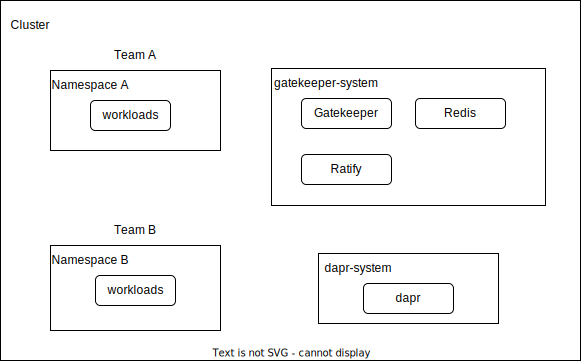

Multi-Tenancy Support
==
Author: Binbin Li (@binbin-li)

# Background
Ratify’s first stable version for production has been officially released, and more customers are adopting it as an external data provider for Gatekeeper. In production environments, numerous clients will enable multi-tenant architecture to enhance resource efficiency within their clusters. To support this scenario, Ratify needs to make some essential refactoring. This document lists some possible designs and corresponding code changes that need to be compared and discussed further.

# Multi-tenancy category
Firstly, the concept of multi-tenancy within a Kubernetes cluster can be broadly categorized into two distinct classifications: [multi-team and multi-customer](https://kubernetes.io/docs/concepts/security/multi-tenancy/#use-cases).
## Multiple teams
In this case, cluster resources are shared between teams within the same organization. And it's usually scoped to a single cluster.
## Multiple customers
In this scenario, multi-tenancy support is usually provided by the service vendor. Customers do not have access to the cluster. And it may consume more resouces to support multiple customers.
## Summary
Given that Ratify primarily operates within a singular cluster, the chosen model for fostering multi-tenancy is the multi-team paradigm. In this framework, the responsibility for managing namespaces and allocating them to respective teams lays with the organization.

# User Scenarios
The overarching use case involves facilitating diverse cluster users in employing Ratify for the application of validation to target images using their individual configurations. However, to enhance the overall user experience, it is imperative to take into account several sub-scenarios.

## User Group
There could be several user groups/roles that have different access to the cluster in an [enterprise environment](https://cloud.google.com/kubernetes-engine/docs/concepts/multitenancy-overview#enterprise_multi-tenancy).
- **Cluster admin**: This role is for administrator of the entire cluster. Cluster admins could CRUD all resources and create namespace and assign to teams.
- **Team admin**: This role is intended for team-specific administrators. A team admin has the authority to manage users within their team. Additionaly team admin can CRUD resources under its namespace. It's possible for a team to be associated with multiple namespaces.
- **Team dev**: Developers in each team. They have the ability to CRUD workloads within their assigned namespaces. But they have no access to Ratify-specific resources, like Ratify CRs.

## Scenarios
1. Cluster administrators have the access to create or delete namespaces and manage team roles.
2. Different teams should not have direct access to resources belonging to other teams.
3. Cluster administrators can oversee and manage access permissions for different teams.
4. Users should find it convenient to deploy and manage the Ratify service in a multi-tenancy scenario.
5. Isolation level: this is a topic that could be explored in a separate section.
6. Resource quota: this is similar to isolation level, which requires a separate section for discussion.
7. In a single cluster, there could be numerous teams collaborating on it, potentially numbering in the hundreds.

# Design Considerations
In addressing the above user scenarios, the design of multi-tenancy support necessitates careful consideration of various aspects.

## Access Control
When considering responsibilities, Ratify should not delve into specifics of role permissions and assignments. Fortunately, there are already some open-source projects available to handle the resource control for the multi-tenancy experience, such as [kiosk](https://github.com/loft-sh/kiosk), [capsule](https://github.com/projectcapsule/capsule). Therefore, Ratify can offload access control to other services. Additionally, various cloud providers offer their own permission controls at namespace level.
- **Azure**: Users can configure Microsoft Entra ID(formerly known as Azure AD) and integrate their AKS cluster with Azure RBAC to [grant access at namespace level](https://learn.microsoft.com/en-us/azure/aks/access-control-managed-azure-ad#apply-just-in-time-access-at-the-namespace-level).
- **AWS**: Users can manage permissions across namespaces in EKS with IAM roles and RBAC. You can refer to this [reference](https://repost.aws/knowledge-center/eks-iam-permissions-namespaces) for details.
- **GCP**: GCP utilize Google Groups and IAM roles to control namespace access. For further information, you can consult this [reference](https://cloud.google.com/kubernetes-engine/docs/best-practices/enterprise-multitenancy).

### User Scenario
1. A cluster admin installs Ratify on the cluster and creates 2 namespaces (namespaceA and namespaceB) for 2 teams (teamA and teamB) respectively.
2. The cluster admin also creates 2 roles and assigns them to the 2 teams, giving each team the permission to create, read, update, and delete resources in their own namespace.
3. Now cluster admin could manage all cluster-wide and namespaced resources.
4. Each team can only access resouces in their own namespace, such as Ratify CRs.
5. Each team can deploy workloads to their namespace according to the relevant policy.

## Data Isolation
### Isolation Level
Data isolation in Kubernetes can be categorized into 2 [types](https://kubernetes.io/docs/concepts/security/multi-tenancy/#isolation):
- **Hard Multi-Tenancy**: It implies a scenario in which tenants have no trust in each other. In this case, different tenants should not have access to namespaces owned by others. Furthermore, the configurations and operations of one tenant should not affect or make a difference to other namespaces.
- **Soft Multi-Tenancy**: It fits the case when tenants could be trusted so that tenants could share a cluster within an organization.

In terms of the Ratify use case, soft multi-tenancy would be more suitable since hard multi-tenancy usually requires a dedicated cluster for each tenant.

### Control Plane Isolation
To ensure control plane isolation, Ratify will implement namespace and Role-Based Access Control (RBAC), as detailed in the preceding section, to segregate access to API resources among different users.

### Data Plane Isolation
Firstly we need to consider what kind of data needs to be isolated or shared.
#### Custom Resource
Ratify has 4 CRDs defined, each of them is crucial to validation workflow. Different teams should have their own CRs generated and cannot alter other teams' CRs.

##### User Scenario
1. Team admin can CRUD Ratify CRs in their namespace and cannot access CRs in other namespaces.
2. Cluster admin can CRUD Ratify CRs across all namespaces.

#### Cache
In the current configuration, Ratify offers support for both in-memory cache and distributed cache.

Concerning in-memory cache, neither the cluster admin nor the team admin possesses direct access. The key focus here is on Ratify's ability to effectively partition the cache for distinct teams, mitigating concerns regarding cache isolation.

In the case of distributed cache, exemplified by Redis, team admins and developers lack direct access to the Redis cluster unless explicitly granted permissions. Notably, cluster admins retain the capability to access Redis pods for manual data retrieval or updates—an occurrence often encountered during debugging tasks. It is crucial to acknowledge a specific scenario where granting a team admin access to Redis pods may inadvertently expose data from other teams within those pods, warranting careful consideration.

##### User Scenario
1. The in-memory cache is inaccessible to both the team admin and the cluster admin, even though they can access the Ratify pods.
2. The cluster admin can read and update the data in the distributed cache, such as Redis.
3. The team admin cannot access the data in the distributed cache without the proper permission.
4. Once the team admin is granted the permission to the Redis cluster and the secret for the encryption key, they can access the data in the distributed cache.
5. Different teams can store data with the same key in the distributed cache without any conflict.
6. The scope of the data that the team admin can access depends on how the Redis cluster is deployed. If there is a single Redis cluster for all the namespaces, the team admin can read data from other namespaces. If there is a separate Redis cluster for each namespace, the team admin can only access data in their own namespace.

##### Cache Partition
1. If each namespace has its own Redis instance, there is no need for cache partitioning, because the data is already separated by namespace.
2. If there is a single Redis cluster for the whole cluster, cache partitioning is necessary, because different teams might have data with the same key. In this case, we can use the namespace as a prefix for the key to avoid conflict.

##### Redis Deployment and Ratify Deployment
The deployment strategy affects the Cache Isolation, as shown above.

Ratify can be deployed either per namespace or per cluster. Redis can also be deployed either per namespace or per cluster. The table below shows the different deployment combinations and their approaches to cache isolation.

|  | Ratify per Namespace | Ratify per Cluster |
|--|--|--|
| Redis per Namespace | Data Isolated | It requires Ratify route requests to Redis instances in different namespaces |
| Redis per Cluster | Prefix keys and restrict access via [ACL](https://redis.io/docs/management/security/acl/) | Prefix keys and restrict access via [ACL](https://redis.io/docs/management/security/acl/) |

#### Log
Ratify saves logs to the standard output and then handled by container runtime. Whatever path does container runtime save logs, those logs may include data from different teams. This situation mirrors the challenges observed with cache isolation.

##### User Scenario
1. Cluster admin could inspect logs from all namespaces via `kubectl logs` command.
2. Team admin could inspect logs from its own namespace  via `kubectl logs` command but has no access to logs from other teams.
3. If users have set up log pipeline on Ratify such as ELK, they can forbid `kubectl logs` and enforce log inspection through Kibana.

##### Isolation
1. If Ratify is deployed per namespace, then logs are isolated by design.
2. If Ratify is deployed once in cluster, there should be some mechanism to partition logs.
    * One solution is adding a namespace field to all Ratify logs. Although this option cannot avoid cross-tenant access without disabling `kubectl logs`, it can be used to filter logs in Kibana.
    * The other solution is to let Ratify partition logs by path. For example, logs from namespaceA are saved to `/var/log/namespaceA` and logs from namespaceB are saved to `/var/log/namespaceB`. This solution can avoid cross-tenant access without disabling `kubectl logs`. However, it requires Ratify to configure logrus output paths for each team explicitly. However, Ratify has to dynamically configure paths for all namespaces, including creating and deleting directories.

#### File system/PVC
The storage and handling of data by Ratify, particularly with considerations for sharing or isolating specific data across teams, introduce additional nuances. Let's explore some scenarios:

##### User Scenario
1. Team admin may need to configure their own verification keys for cosign verifiers.
2. Team admin may need to configure their own plugins for notation verifiers.
3. Only cluster admin has permission to set up static external plugins, such as cosign/sbom verifiers. This is done by deploying a Ratify image with external plugins built. Team admin can apply CRs under their own namespace to use configured external plugins.
4. Cluster admin has permission to apply CRs to download dynamic external plugins.
5. [optional] Team admins can download them via applying CRs as well. And different teams could download their own plugins of the same name without conflicts.

##### Key Points
1. Nature of Data Sharing:
    - Certain data, such as TLS certs, may be permissible and intended for shared use across teams. Conversely, team-specific data like cosign certs, plugin directories, and local_oras_cache require careful isolation to maintain team autonomy.
2. Ratify Deployment and Data Isolation:
    - If Ratify is deployed per namespace, the data isolation is achieved by the RBAC and namespace settings. Only the team members in that namespace can access the data shared within it.
    - If Ratify is deployed across multiple namespaces, Ratify has to enforce data isolation for certain data types. This is important for data that belongs to specific teams and should not be shared with others.
3. Cosign Key Isolation:
    - Currently, cosign keys are configured by mounting volumes, which requires manual steps during Ratify installation. If a new namespace is created or an existing one is deleted, users have to redeploy or upgrade Ratify with the updated volume configuration, which is inconvenient.
    - We can also refactor the cosign verifier to make it similar to the notation verifier. In this case, users can configure cosign keys through Ratify CRs when they create or delete namespaces without restarting Ratify.
4. Plugin Directory Isolation:
    - The downloaded dynamic plugins should also be isolated by namespace. In this case, we can store plugins in different directories where the path is identified by namespace. However, since Ratify does not listen to namespace events, Ratify cannot delete the directory for a deleted namespace. 
5. Local_oras_cache
    - Theoretically, it's impossible for different tenants to access different blobs with the same descriptor. But if we really want to isolate oras_cache between tenants, there are 2 options.
    - In local_oras_cache, the descriptor acts as cache key. If we divide a single cache by namespace, then Ratify has to add a namespace annotation to the descriptor.
    - On the other hand, if we make a new store for each namespace, then we do not need to split the cache or modify the descriptor.
6. Potential Consideration for PVC (Persistent Volume Claim):
    - The introduction of PVCs could enhance the management of data storage by providing a more structured and scalable approach. However, this also necessitates careful design considerations to align with the desired level of data isolation.

#### Remote Data Isolation
Ratify supports remote data sources, such as registry and key vault. In this case, Ratify has to be authorized to fetch data from the remote service, which introduced another layer of data isolation.

##### User Scenario
1. Cluster admin configures Ratify with correct permissions to access data from remote registry and key vault. After that, all teams could validate images with configured remote registry and key vault.
2. [Optional] Team admin can also configure their own remote registry and key vault. Notably, different teams cannot access remote services across namespaces.

##### Isolation
Firstly we need to consider if the data isolation is required for remote service as Ratify just fetches data without modification and tenants cannot access those data directly. 

If we decide to isolate remote service, Ratify would reply on cluster's access control to support this layer of isolation. Ratify itself does not own the auth with remote service. And Ratify has no context on the identity of a validation operator. This might be a limitation of Ratify.

#### Metrics
Ratify exports metrics at pod level. There are multiple metrics set up for users to instrument the service. However, it's possible that different teams may want to collect metrics at team level for more detailed instrumentation.

If Ratify is deployed per namespace, the metrics are partitioned automatically by namespace.

If Ratify is deployed per cluster, we can add namespace as a label to all metrics for filtering.

#### Mutation
Ratify utilizes Gatekeeper's mutation feature to resolve image tag to image reference for better security. Currently Ratify enables it by default. In multi-tenancy scenario, we need to consider if we should enable it for all tenants.

##### User Scenario
1. Cluster admin enables tag mutation for all namespaces. Team admins cannot override this feature to disable it.
2. Cluster admin disables tag mutation for all namespaces. 
    * Team admin can override this feature to enable it for better security.
    * Team admin cannot override this feature to enable it.

##### Isolation
Mutation policies are defined using mutation-specific [CRDs](https://open-policy-agent.github.io/gatekeeper/website/docs/mutation/). Specifically Ratify use `Assign` CRs to configure image tag mutation. However, `Assign` CR is clustered resource, we cannot apply `Assign` CRs in different namespaces. In the multi-tenancy scenario, there could be 2 options to configure image tag mutation.

1. Only allow cluster admin to enable/disable image tag mutation.
2. We could utilize the `namespaces` and `excludedNamespaces`
criteria under `match` section in `Assign` CR. Upon configuration change for a namespace, this namespace should be added/deleted to corresponding criteria.

## Resource Quota
Resouce Quota is not as critical as data isolation. In most cases and current implementation, Ratify only has resource quota of CPU/Memory on a pod. However, in certain cases, some tenants may consume too much computing or storage resources which may harm the overall service performance.
Same as previous topics, the implementation depends on how we deploy Ratify. If Ratify is deployed per namespace, we can configure ResourceQuota and LimitRange to assign limits for Ratify pods per namepsace. On the contrary, a single Ratify deployment cannot utilize ResourceQuota and LimitRange to pre-define the allocation of resources for each namespace, which will offload responsibility to Ratify itself.

## Cluster-wide Image Validation
Even though tenants could validate their own images in corresponding namespaces, there could be requirement to support a cluster-wide policy for image validation. There are 2 potential user scenarios for cluster-wide validation:

1. Cluster-wide policy only works for images that are missing namespaced policies.
2. Cluster-wide policy dominates the decision making even though the namespaced policies exist.

Notes: the conclusion from recent discussion is to adopt option 1. So the namespaced policy has higher priority than cluster-wide policy.

There could be 2 options to support cluster-wide validation.
1. Have separate namespaced and clustered Ratify CRs. Cluster admin has the access to configure both cluster-wide and namespaced CRs. Team admins can only access namespaced CRs. Both CRs would look almost the same except for the scope. Users would have to maintain 2 sets of CRs but don't need to reserve a namespace for cluster-wide CRs.
2. Have only namespaced Ratify CRs. For the cluster-wide CRs, we reserve a namespace for it, such as gatekeeper-system. And only cluster admin could access resources in reserved namespace. In this option, users only need to maintain a single CRD but have to keep a reserved namespace.

## User Experience
We've discussed several aspects concerning functionalities and implementation. However, we also need to consider the user experience when enabling multi-tenancy support.

From the perspective of user experience, it makes a great difference between 2 deployment strategy.

### Deployment per Namespace
1. Cluster admin or team admin must deploy a Ratify service in each required namespace.
2. Upon a new namespace created, cluster admin or team admin must deploy a Ratify service for it. Otherwise there should be some mechanism to automate it. Additionally, admin needs to apply new `Provider` CRs and update `Assign` CRs if individual control on tag mutation is required.
3. And if customers want to have a different Redis instance for each namespace, they have to maintain the Redis deployment as well.
4. Data isolation is more strict following this strategy. And customers have more granular control over Ratify configurations, such as cache config and log config.
5. Users need to maintain their own TLS certificates for mTLS between Gatekeeper and Ratify.

### Deployment per Cluster
1. Cluster admin must deploy a Ratify service in the cluster.
2. There is no need to deploy new Ratify service upon namespace creation. Admin only needs to update `Assign` CRs if individual control on tag mutation is required.
3. If customers want to have a different Redis instance for each namespace, they have to maintain the Redis deployment as well.
4. Data isolation is weaker following this strategy. And it has some limitation on the granularity of Ratify configurations, such as cache config and log config.
5. Users don't need to manually maintain TLS certificates.

# Proposed Solutions
As we already discussed a few areas that needs to be considered for multi-tenancy, there are 2 general options to Ratify's use case. These 2 options are different in terms of how we deploy Ratify service in the cluster.

## Ratify Deployment per Namespace or Cluster
Current Ratify is deployed under gatekeeper-system namespace by default. In the multi-tenancy case, users could either deploy a Ratify service in each namespace or in a specific namespace, such as gatekeeper-system.

Notes: a Ratify service includes all dependency service, such as Redis.

An overview of deployment per namespace:

An overview of deployment per cluster:

Both options can support multi-tenancy model, each one has its pros and cons, here is a brief comparison of 2 option, and details can be explored in the following sections.

| | Deployment per Namespace | Deployment per Cluster |
|--|---|---|
| Core workflow refactoring | easy | hard |
| Helm templates refactoring | hard | easy |
| ED request struct | no change | add namespace |
| ED request number | 1 request per Ratify deployment | 1 request |
| Resouce Quota | easy | hard |
| Log isolation | easy | hard |
| Cache isolation | easy | hard |
| Metrics isolation | easy | hard |
| Resouce efficiency | low | high |
| User Experience | hard | easy |
| Ratify configuration control | fine-grained control | limited |

### Deployment per Namespace
#### Pros
1. Minimal refacotring on Ratify. Since Ratify is deployed to each required namespace, Ratify itself doesn't need to care too much about the data isolation across namespaces. Instead it can offload multi-tenancy responsibility to the control plane.
2. Distributed cache service can be deployed per namespace as well to support cache isoaltion easily.
3. No need to add namespace to the external data request from GK to Ratify. We can keep the same request struct.
4. Users could easily set up ResourceQuota and LimitRange to assign appropriate resources.
5. As Ratify pods are isolated by namespace, each team can only access its own logs.
6. Fine-grained control over Ratify configurations, such as cache config and log config.
7. Metrics ioslation is easily achieved automatically.

#### Cons
1. Consume more resources. Each Ratify service requires at least one pod, and if HA enabled, Redis cluster is deployed to each namespace as well. In the case of hundreds of tenants, it requires hundreds of Ratify deployment even though there might be few workload being used.
2. For each Ratify in a namespace, Gatekeeper regards each as a separate external data provider. Therefore, for each admission review to Gatekeeper, GK will send out validation requests to all Ratify services across all namespaces.
3. More manual work for deployment. Once a new namespace created, a new Ratify deployment is required on it.
4. How does Ratify trust Gatekeeper(mTLS)? Current Ratify follows the first [approach](https://open-policy-agent.github.io/gatekeeper/website/docs/externaldata/#how-the-external-data-provider-trusts-gatekeeper-mtls) recommended by GK. However, it requires Ratify deployed in the same namespace as GK. Therefore, we have to maintain a cluster-wide, well-known CA cert for GK so that Ratify services in all namespaces could trust it.

#### Implementation Detail
This option requires minimal code changes to Ratify core workflow as Ratify itself doesn't handle the multi-tenancy scenario. However, we have to make a lot of changes to the helm templates/helmfile, making each Ratify service deployed in each namespace. And all Custom Resources should be namespaced instead of clustered.

### Deployment per Cluster
#### Pros
1. More resource efficent. Since there is only one Ratify deployment in the cluster, all tenants share the same Ratify pods and dependency resources. If the load traffic increases, admin could easily scale out the Ratify service accordingly.
2. GK will work in the current way that sends out one ED request to Ratify for each admission review.
3. Users only need to deploye once when enabling Ratify feature in the cluster. Afterwards, admins can configure CRs in their own namespaces.
4. Since GK and Ratify can be deployed to the same namespace, we can enable `cert-controller` of GK to set up mTLS automatically.

#### Cons
1. As current Ratify framework was designed for single tenant use case, we need to make corresponding updates to most components, like verifier/store/certStore/policy.
2. For distributed cache, take Redis as an example, we should consider if Redis is deployed per namespace or cluster.
3. For Ratify logs, we can either save logs to the same path or different paths per namespace depending on the decision of isolation level. Same to the filesystem(specifically oras_local_cache).
4. Unable to configure ResourceQuota and LimitRange for each namespace.
5. In the external data request from GK to Ratify, it has to add `namespace` besides the existing `images` field though it can be a backward compatible change.
6. Coarse-grained control over Ratify configurations.
7. There is limitation to isolate metrics by namespace. But we can add namespace as a label to all metrics for filtering.

#### Implementation Detail
This option requires minimal updates to the helm templates as Ratify is only deployed to single namespace like before. However, Ratify itself needs to handle the multi-tenancy model. Besides making Custom Resources namespaced, we also need to maintain a mapping from namespace to their own resources, such as verifiers/stores/certStores/policies in Ratify core workflow. Furthermore, depending on how we decide the isolation level of cache/file system/logs, we may partition those data by namespace.

# Conclusion
The comprehensive exploration of various aspects related to the multi-tenancy model in this document has laid the groundwork for informed decision-making. The proposed options, each with its set of advantages and considerations, provide a basis for further discussion and consensus-building.

# Open for Discussion
1. Which approach should we choose for deploying Ratify? Should we go with deployment per cluster or per namespace? [reference](#ratify-deployment-per-namespace-or-cluster)
    - After some recent discussions, we are currently favoring deployment per cluster.
2. When deciding between cluster-wide policy and namespaced policy, which one should take precedence? [reference](#cluster-wide-image-validation)
    - After recent discussions, we are currently inclined towards favoring namespaced policy.
3. Which approach should we take for Redis deployment? Deploy per cluster or per namespace? [reference](#redis-deployment-and-ratify-deployment)
    - After recent discussions, we are currently leaning towards deploying a centralized Redis cluster.
4. For cluster-wide CRs, should we consider making it clustered resource or namespaced resource under a reserved namespace, such as gatekeeper-system? [reference](#cluster-wide-image-validation)
    - Clustered CR means users need to maintain 2 sets of CRs which is the same as Kyverno. But it requires Ratify support 2 sets of CRs and corresponding controllers.
    - Namespaced CR requires a reserved namespace. And it might be confusing to users to distinguish between namespaced CRs and cluster-wide CRs.
5. Should we allow team admins download external plugins via applying CRs? [reference](#user-scenario-4)
    - Cluster admin has permission to download plugins for all teams.
    - We could support global download firstly.
6. Should we allow team admins switch tag mutation feature? [reference](#mutation)
    - Cluster admin is able to enable/disable image tag mutation.
    - We could support global image tag mutation firstly. And if there is a strong requirement for individual control, we could add it later.