Ratify Error Handling Scenarios
===
Author: Binbin Li

Table of Contents
=================

- [Ratify Error Handling Scenarios](#ratify-error-handling-scenarios)
- [Table of Contents](#table-of-contents)
- [Overview](#overview)
- [Objective](#objective)
  - [Areas for Enhancement](#areas-for-enhancement)
- [Stages](#stages)
  - [Diagnostic Review](#diagnostic-review)
  - [Error Message Clarification](#error-message-clarification)
  - [Nested Error Refactoring](#nested-error-refactoring)
- [User Scenarios](#user-scenarios)
  - [Configuration](#configuration)
    - [KMP](#kmp)
      - [Invalid spec.type | Juncheng](#invalid-spectype--juncheng)
        - [Current Error](#current-error)
        - [Improvements](#improvements)
      - [Invalid spec.parameters.contentType | Juncheng](#invalid-specparameterscontenttype--juncheng)
        - [Current Error](#current-error-1)
        - [Improvement](#improvement)
      - [Invalid certificate provided for inline provider | Juncheng](#invalid-certificate-provided-for-inline-provider--juncheng)
        - [Current Error](#current-error-2)
        - [Improvement](#improvement-1)
      - [Invalid key provided for inline provider | Juncheng](#invalid-key-provided-for-inline-provider--juncheng)
        - [Current Error](#current-error-3)
      - [Wrong vaultURI for AKV provider | Juncheng](#wrong-vaulturi-for-akv-provider--juncheng)
        - [Current Error](#current-error-4)
      - [Wrong certificate name for AKV provider | Juncheng](#wrong-certificate-name-for-akv-provider--juncheng)
        - [Current Error](#current-error-5)
      - [Invalid certificate version for AKV provider | Juncheng](#invalid-certificate-version-for-akv-provider--juncheng)
        - [Current Error](#current-error-6)
      - [Wrong tenantID or clientID for AKV provider | Juncheng](#wrong-tenantid-or-clientid-for-akv-provider--juncheng)
        - [Current Error](#current-error-7)
    - [Store](#store)
      - [useHttp is enabled for public registry | Binbin](#usehttp-is-enabled-for-public-registry--binbin)
        - [Current Error](#current-error-8)
      - [Invalid authProvider(we support multiple providers, probably docker/Azure/AWS are main use case), e.g. wrong clientID for azureWorkloadIdentity](#invalid-authproviderwe-support-multiple-providers-probably-dockerazureaws-are-main-use-case-eg-wrong-clientid-for-azureworkloadidentity)
    - [Verifier](#verifier)
      - [Notation verifier references invalid certStore | Susan](#notation-verifier-references-invalid-certstore--susan)
        - [Current Error](#current-error-9)
        - [Improvement](#improvement-2)
      - [Invalid artifactTypes in notation verifier | Susan](#invalid-artifacttypes-in-notation-verifier--susan)
        - [Current Error](#current-error-10)
        - [Improvement](#improvement-3)
      - [invalid(non-existing) trustStores | Susan](#invalidnon-existing-truststores--susan)
        - [Current Error](#current-error-11)
        - [Improvement](#improvement-4)
      - [Unsupported registryScope | Susan](#unsupported-registryscope--susan)
        - [Current Error](#current-error-12)
        - [Improvement](#improvement-5)
      - [Invalid trustedIdentity | Susan](#invalid-trustedidentity--susan)
        - [Current Error](#current-error-13)
      - [Certificate has no matching trusted identity | Susan](#certificate-has-no-matching-trusted-identity--susan)
        - [Current Error](#current-error-14)
      - [Cosign verifier references invalid key provider | Binbin](#cosign-verifier-references-invalid-key-provider--binbin)
        - [Current Error](#current-error-15)
      - [Invalid artifactTypes in cosign verifier(same question) | Binbin](#invalid-artifacttypes-in-cosign-verifiersame-question--binbin)
        - [Current Error](#current-error-16)
        - [Improvement](#improvement-6)
      - [Unsupported scope is provided in cosign verifier | Binbin](#unsupported-scope-is-provided-in-cosign-verifier--binbin)
        - [Current Error](#current-error-17)
      - [Conflict scopes from multiple policies in cosign verifier | Binbin](#conflict-scopes-from-multiple-policies-in-cosign-verifier--binbin)
        - [Current Error](#current-error-18)
      - [Invalid cert identity/cert OIDC issuer for keyless cosign verifier | Binbin](#invalid-cert-identitycert-oidc-issuer-for-keyless-cosign-verifier--binbin)
        - [Current Error](#current-error-19)
      - [Configured keyless cosign verifier to verify a keyed signature | Binbin](#configured-keyless-cosign-verifier-to-verify-a-keyed-signature--binbin)
        - [Current Error](#current-error-20)
      - [Cosign verifier configured a wrong public key | Binbin](#cosign-verifier-configured-a-wrong-public-key--binbin)
        - [Current Error](#current-error-21)
      - [Cosign verifier references non-existent kmp | Binbin](#cosign-verifier-references-non-existent-kmp--binbin)
        - [Current Error](#current-error-22)
    - [Policy](#policy)
      - [`metadata.name` is changed other than ratify-policy | Binbin](#metadataname-is-changed-other-than-ratify-policy--binbin)
        - [Current Error](#current-error-23)
      - [Invalid spec.type | Binbin](#invalid-spectype--binbin)
        - [Current Error](#current-error-24)
      - [Invalid policy value except `all` and `or` in config policy | Binbin](#invalid-policy-value-except-all-and-or-in-config-policy--binbin)
        - [Current Error](#current-error-25)
      - [Invalid policy string is provided in rego policy | Binbin](#invalid-policy-string-is-provided-in-rego-policy--binbin)
        - [Current Error](#current-error-26)
  - [Access Control](#access-control)
    - [ACR](#acr)
      - [`AcrPull` role is not assigned | Juncheng](#acrpull-role-is-not-assigned--juncheng)
        - [Current Error](#current-error-27)
        - [Improvement](#improvement-7)
    - [AKV](#akv)
      - [`Key Vault Secrets User` role is not assigned for notation signature | Juncheng](#key-vault-secrets-user-role-is-not-assigned-for-notation-signature--juncheng)
        - [Current Error](#current-error-28)
        - [Improvement](#improvement-8)
      - [`Key Vault Crypto User` role is not assigned for cosign signature | Juncheng](#key-vault-crypto-user-role-is-not-assigned-for-cosign-signature--juncheng)
        - [Current Error](#current-error-29)
        - [Improvement](#improvement-9)
  - [Signature Verification](#signature-verification)
      - [No matching verifier for notation signature | Akash](#no-matching-verifier-for-notation-signature--akash)
        - [Test Error](#test-error)
        - [Improvment](#improvment)
      - [No matching verifier for cosign signature | Akash](#no-matching-verifier-for-cosign-signature--akash)
        - [Test Error](#test-error-1)
      - [Image is not signed | Akash](#image-is-not-signed--akash)
        - [Current Error](#current-error-30)
        - [Improvement](#improvement-10)
      - [Image is signed with notation signature, but KMP provides a different certificate resulting to verification failure | Akash](#image-is-signed-with-notation-signature-but-kmp-provides-a-different-certificate-resulting-to-verification-failure--akash)
        - [Current Error](#current-error-31)
        - [Improvement](#improvement-11)
      - [Image is signed with cosign signature, but KMP provides a different key resulting to verification failure | Akash](#image-is-signed-with-cosign-signature-but-kmp-provides-a-different-key-resulting-to-verification-failure--akash)
        - [Current Error](#current-error-32)
      - [Images are signed by unknown identities so that verification should fail. (Notary Project signatures) | Akash](#images-are-signed-by-unknown-identities-so-that-verification-should-fail-notary-project-signatures--akash)
        - [Current Error](#current-error-33)
        - [Improvement](#improvement-12)
      - [Images are signed by unknown keys so that verification should fail (Cosign key-pair signatures) | Akash](#images-are-signed-by-unknown-keys-so-that-verification-should-fail-cosign-key-pair-signatures--akash)
        - [Current Error](#current-error-34)
      - [Revocation: Images are signed with revoked certificates](#revocation-images-are-signed-with-revoked-certificates)
      - [Timestamp: Images are signed before certificate expired but cert is expired now (Time-stamp support is required and users specify TSA root certificate)](#timestamp-images-are-signed-before-certificate-expired-but-cert-is-expired-now-time-stamp-support-is-required-and-users-specify-tsa-root-certificate)
      - [Images are signed with multiple signatures, but some signature is missing matching verifier | Binbin](#images-are-signed-with-multiple-signatures-but-some-signature-is-missing-matching-verifier--binbin)
        - [Current Error](#current-error-35)
      - [Images are signed with multiple signatures, and policy requires all signatures pass. | Binbin](#images-are-signed-with-multiple-signatures-and-policy-requires-all-signatures-pass--binbin)
        - [Current Error](#current-error-36)
      - [Images are signed with multiple signatures, and no matching verifiers configured | Binbin](#images-are-signed-with-multiple-signatures-and-no-matching-verifiers-configured--binbin)
        - [Current Error](#current-error-37)
      - [Images are signed with multiple signatures, and policy requires at least one signature pass | Binbin](#images-are-signed-with-multiple-signatures-and-policy-requires-at-least-one-signature-pass--binbin)
        - [Current Error](#current-error-38)
        - [Improvement](#improvement-13)
      - [certificate is rotated, but Ratify didn't refresh it and previous cert is expired | Binbin](#certificate-is-rotated-but-ratify-didnt-refresh-it-and-previous-cert-is-expired--binbin)
        - [Current Error](#current-error-39)
      - [key is rotated, but Ratify didn't refresh it | Binbin](#key-is-rotated-but-ratify-didnt-refresh-it--binbin)
        - [Current Error](#current-error-40)
      - [Timeout during keyless cosign verification](#timeout-during-keyless-cosign-verification)
      - [Timeout from requests to remote registry](#timeout-from-requests-to-remote-registry)
      - [Timeout during cert revocation evaluation for notation signature](#timeout-during-cert-revocation-evaluation-for-notation-signature)

# Overview

Ratify has received a lot of valuable feedback on the error handling. Recognizing that the current errors are either too cryptic or excessively detailed, we are now committed to refining our error handling processes to improve overall user satisfaction.

# Objective

The target of this improvement is mainly focusing on the user expericence. So we'll start from current behavior in different user scenarios. Then we could compare the current behaivor and expected behavior to assess areas/directions we could improve.

Our enhancement efforts are aimed at elevating the user experience. We will begin by examining the existing error responses across various user scenarios. By contrasting the present and ideal outcomes, we will identify and prioritize improvements.

## Areas for Enhancement
We have pinpointed several key areas for potential enhancement:
1. Error message or detail for each specific scenario. Currently different issues could result to identical error, leading to user confusion. We aim to differentiate the error feedback more clearly.
2. How to wrap up the nested error. While nested error offer comprehensive details, they can overwhelm users and are often too lengthy for practical disolay.
3. How to handle the error originating from dependencies?

# Stages
I plan to complete the error handling improvement in 3 stages.
## Diagnostic Review
Initially, we will conduct a thorough review of the most common error-generating scenarios. We’ll evaluate the clarity of the errors for both customers and Ratify developers.
## Error Message Clarification
We will ensure that each scenario yields a precise error message that pinpoints the root cause, including those stemming from dependencies.
## Nested Error Refactoring
We will restructure the nested error framework to maintain clarity and retain essential information for the users.

# User Scenarios

In general, there are 3 major scenarios could produce errors.
- Configration Error(excluding certificate)
- Access Controll Error
- Signature Verififcation Failures(including policy evaluation failure)

Feel free to add more test cases under each section.

## Configuration

### KMP

#### Invalid spec.type | Juncheng
##### Current Error
Error log: 
```
time=2024-07-15T23:43:55.170100941Z level=error msg=Reconciler error KeyManagementProvider=keymanagementprovider-akv controller=keymanagementprovider controllerGroup=config.ratify.deislabs.io controllerKind=KeyManagementProvider error=failed to create key management provider provider: key management provider factory with name notazurekeyvault not found name=keymanagementprovider-akv namespace= reconcileID=baff8d41-5889-4a39-85ff-efd9d02c8372
```

##### Improvements
KMP does not support type of ...

#### Invalid spec.parameters.contentType | Juncheng
##### Current Error
Error log 1: 
```
time=2024-07-17T12:54:37.380991457Z level=error msg=Reconciler error KeyManagementProvider=keymanagementprovider-inline controller=keymanagementprovider controllerGroup=config.ratify.deislabs.io controllerKind=KeyManagementProvider error=failed to create key management provider provider: Error: config invalid, Code: CONFIG_INVALID, Component Type: keyManagementProvider, Detail: content type notcertificate is not supported name=keymanagementprovider-inline namespace= reconcileID=4bbc444a-3326-45fb-b1fd-5fb09c6aa563
```
Error log 2: 
```
time=2024-07-17T14:14:29.313249456Z level=error msg=Reconciler error KeyManagementProvider=keymanagementprovider-inline controller=keymanagementprovider controllerGroup=config.ratify.deislabs.io controllerKind=KeyManagementProvider error=failed to create key management provider provider: Error: config invalid, Code: CONFIG_INVALID, Component Type: keyManagementProvider, Detail: contentType parameter is not set name=keymanagementprovider-inline namespace= reconcileID=f1340181-e790-45e2-9c46-30ddb85441d1
```

##### Improvement

#### Invalid certificate provided for inline provider | Juncheng
##### Current Error

Error log: 
```
time=2024-07-17T12:57:02.094428327Z level=error msg=Reconciler error KeyManagementProvider=keymanagementprovider-inline controller=keymanagementprovider controllerGroup=config.ratify.deislabs.io controllerKind=KeyManagementProvider error=failed to create key management provider provider: Error: cert invalid, Code: CERT_INVALID, Component Type: certProvider, Detail: failed to decode pem block name=keymanagementprovider-inline namespace= reconcileID=bfe6ded8-21de-4a10-9a24-72bed094e682
```

##### Improvement
Report error while parsing the public certificate

#### Invalid key provided for inline provider | Juncheng
##### Current Error
Error log: 
```
time=2024-07-17T13:06:39.146768643Z level=error msg=Reconciler error KeyManagementProvider=keymanagementprovider-inline controller=keymanagementprovider controllerGroup=config.ratify.deislabs.io controllerKind=KeyManagementProvider error=failed to create key management provider provider: Original Error: (PEM decoding failed), Error: key invalid, Code: KEY_INVALID, Component Type: keyManagementProvider, Detail: error parsing public key name=keymanagementprovider-inline namespace= reconcileID=1a5d7e8f-5fc0-4b22-a371-fe871218ec1e
```

#### Wrong vaultURI for AKV provider | Juncheng
##### Current Error
Error log for valid URL: 
```
time=2024-07-16T07:56:11.14480023Z level=error msg=Reconciler error KeyManagementProvider=keymanagementprovider-akv controller=keymanagementprovider controllerGroup=config.ratify.deislabs.io controllerKind=KeyManagementProvider error=Error fetching certificates in KMProvider keymanagementprovider-akv with azurekeyvault provider, error: failed to get secret objectName:wabbit-networks-io, objectVersion:, error: keyvault.BaseClient#GetSecret: Failure sending request: StatusCode=0 -- Original Error: Get "https://notroakv.vault.azure.net/secrets/wabbit-networks-io/?api-version=7.1": dial tcp: lookup notroakv.vault.azure.net on 10.0.0.10:53: no such host name=keymanagementprovider-akv namespace= reconcileID=ec30a479-d739-438f-a5a8-49e8394f4ae4` <br/> Error log for invalid URL: `time=2024-07-16T08:05:33.552739275Z level=error msg=Reconciler error KeyManagementProvider=keymanagementprovider-akv controller=keymanagementprovider controllerGroup=config.ratify.deislabs.io controllerKind=KeyManagementProvider error=Error fetching certificates in KMProvider keymanagementprovider-akv with azurekeyvault provider, error: failed to get secret objectName:wabbit-networks-io, objectVersion:, error: keyvault.BaseClient#GetSecret: Failure preparing request: StatusCode=0 -- Original Error: autorest: No scheme detected in URL .net/ name=keymanagementprovider-akv namespace= reconcileID=47f71684-2730-4545-979f-cc1598c6b88f
```

#### Wrong certificate name for AKV provider | Juncheng
##### Current Error
```
time=2024-07-16T08:38:40.583971705Z level=error msg=Reconciler error KeyManagementProvider=keymanagementprovider-akv controller=keymanagementprovider controllerGroup=config.ratify.deislabs.io controllerKind=KeyManagementProvider error=Error fetching certificates in KMProvider keymanagementprovider-akv with azurekeyvault provider, error: failed to get secret objectName:notwabbit-networks-io, objectVersion:, error: keyvault.BaseClient#GetSecret: Failure responding to request: StatusCode=404 -- Original Error: autorest/azure: Service returned an error. Status=404 Code="SecretNotFound" Message="A secret with (name/id) notwabbit-networks-io was not found in this key vault. If you recently deleted this secret you may be able to recover it using the correct recovery command. For help resolving this issue, please see https://go.microsoft.com/fwlink/?linkid=2125182" name=keymanagementprovider-akv namespace= reconcileID=358953da-30a6-419c-8628-5583637e17c3
```

#### Invalid certificate version for AKV provider | Juncheng
##### Current Error
Error log: 
```
time=2024-07-15T23:52:33.66317963Z level=error msg=Reconciler error KeyManagementProvider=keymanagementprovider-akv controller=keymanagementprovider controllerGroup=config.ratify.deislabs.io controllerKind=KeyManagementProvider error=Error fetching certificates in KMProvider keymanagementprovider-akv with azurekeyvault provider, error: failed to get secret objectName:wabbit-networks-io, objectVersion:invalidVersion, error: keyvault.BaseClient#GetSecret: Failure responding to request: StatusCode=400 -- Original Error: autorest/azure: Service returned an error. Status=400 Code="BadParameter" Message="Method GET does not allow operation 'invalidVersion'" name=keymanagementprovider-akv namespace= reconcileID=481b14c6-0990-4413-9563-38d0ad0e180d
```

#### Wrong tenantID or clientID for AKV provider | Juncheng

##### Current Error 
Wrong tenantID Error log: 
```
time=2024-07-16T08:41:45.101552175Z level=error msg=Reconciler error KeyManagementProvider=keymanagementprovider-akv controller=keymanagementprovider controllerGroup=config.ratify.deislabs.io controllerKind=KeyManagementProvider error=failed to create key management provider provider: Original Error: (Original Error: (failed to acquire token: failed to acquire AAD token: unable to resolve an endpoint: http call(https://login.microsoftonline.com/<omit_invalidTenantID>/v2.0/.well-known/openid-configuration)(GET) error: reply status code was 400:{"error":"invalid_tenant","error_description":"AADSTS90002: Tenant '<omit_invalidTenantID>' not found. Check to make sure you have the correct tenant ID and are signing into the correct cloud. Check with your subscription administrator, this may happen if there are no active subscriptions for the tenant. Trace ID: 5dd3d897-77ec-454b-907d-fca043f35600 Correlation ID: 2e2eacc0-4b67-43e0-8218-22de0a18a1eb Timestamp: 2024-07-16 08:41:45Z","error_codes":[90002],"timestamp":"2024-07-16 08:41:45Z","trace_id":"5dd3d897-77ec-454b-907d-fca043f35600","correlation_id":"2e2eacc0-4b67-43e0-8218-22de0a18a1eb","error_uri":"https://login.microsoftonline.com/error?code=90002"}), Error: auth denied, Code: AUTH_DENIED, Plugin Name: azurekeyvault, Component Type: keyManagementProvider, Documentation: https://learn.microsoft.com/en-us/azure/key-vault/general/overview, Detail: failed to get authorizer for keyvault client, Stack trace: goroutine 311 [running] ... Error: plugin init failure, Code: PLUGIN_INIT_FAILURE, Plugin Name: azurekeyvault, Component Type: keyManagementProvider, Documentation: https://learn.microsoft.com/en-us/azure/key-vault/general/overview, Detail: failed to create keyvault client name=keymanagementprovider-akv namespace= reconcileID=8cb1dd6a-0e92-4f84-bd04-ccc32e98906d` </br> Wrong clientID Error log:`time=2024-07-16T08:50:37.655092495Z level=error msg=Reconciler error KeyManagementProvider=keymanagementprovider-akv controller=keymanagementprovider controllerGroup=config.ratify.deislabs.io controllerKind=KeyManagementProvider error=failed to create key management provider provider: Original Error: (Original Error: (failed to acquire token: failed to acquire AAD token: FromAssertion(): http call(https://login.microsoftonline.com/<omit-tenantId>/oauth2/v2.0/token)(POST) error: reply status code was 400: {"error":"unauthorized_client","error_description":"AADSTS700016: Application with identifier '<omit-invalid_clientID>' was not found in the directory 'Microsoft'. This can happen if the application has not been installed by the administrator of the tenant or consented to by any user in the tenant. You may have sent your authentication request to the wrong tenant. Trace ID: bd8356e9-e3a1-4604-bee8-f11e6a4f4200 Correlation ID: 5daee285-5a95-4f61-85b4-2f5332996b62 Timestamp: 2024-07-16 08:50:22Z","error_codes":[700016],"timestamp":"2024-07-16 08:50:22Z","trace_id":"bd8356e9-e3a1-4604-bee8-f11e6a4f4200","correlation_id":"5daee285-5a95-4f61-85b4-2f5332996b62","error_uri":"https://login.microsoftonline.com/error?code=700016"}), Error: auth denied, Code: AUTH_DENIED, Plugin Name: azurekeyvault, Component Type: keyManagementProvider, Documentation: https://learn.microsoft.com/en-us/azure/key-vault/general/overview, Detail: failed to get authorizer for keyvault client, Stack trace: goroutine 311 [running] ..., Error: plugin init failure, Code: PLUGIN_INIT_FAILURE, Plugin Name: azurekeyvault, Component Type: keyManagementProvider, Documentation: https://learn.microsoft.com/en-us/azure/key-vault/general/overview, Detail: failed to create keyvault client name=keymanagementprovider-akv namespace= reconcileID=0676c027-9dda-44c5-8769-c49f18f8d5b5
```

### Store
#### useHttp is enabled for public registry | Binbin
##### Current Error
Mutation failure: 
```
Error from server: admission webhook "mutation.gatekeeper.sh" denied the request: failed to resolve external data placeholders: failed to validate external data response from provider ratify-mutation-provider: non-empty system error: operation failed with error operation timed out after duration 1.95s` and no error log. Validation failure: `Error from server (Forbidden): admission webhook "validation.gatekeeper.sh" denied the request: [ratify-constraint] System error calling external data provider: operation failed with error operation timed out after duration 4.9s` error log: `"message": "verification failed: Original Error: (Get \"https://azure.microsoft.com/services/container-registry/\": context deadline exceeded), Error: list referrers failure, Code: LIST_REFERRERS_FAILURE, Plugin Name: oras, Component Type: referrerStore"
```

#### Invalid authProvider(we support multiple providers, probably docker/Azure/AWS are main use case), e.g. wrong clientID for azureWorkloadIdentity

### Verifier
#### Notation verifier references invalid certStore | Susan
##### Current Error
```
"verifierReports": [
    {
      "isSuccess": false,
      "name": "verifier-notation",
      "type": "notation",
      "message": "Original Error: (Original Error: (unable to fetch certificates for namedStore: certs), Error: verify plugin failure, Code: VERIFY_PLUGIN_FAILURE, Plugin Name: verifier-notation, Component Type: verifier, Documentation: https://ratify.dev/docs/troubleshoot/verifier/notation, Detail: failed to verify signature of digest), Error: verify reference failure, Code: VERIFY_REFERENCE_FAILURE, Plugin Name: verifier-notation, Component Type: verifier",
      "artifactType": "application/vnd.cncf.notary.signature"
    }
  ]
```

##### Improvement
Keep:
This error is useful unable to fetch certificates for namedStore: certs
ToImprove:

1. Message maybe too verbose ( will get fixed if we remove nesting)
2. Message ideally should include action item like please validate your cert store name
3. Would a more specific error code help?

#### Invalid artifactTypes in notation verifier | Susan

##### Current Error
```
"verifierReports": [
    {
      "subject": "ghcr.io/deislabs/ratify/notary-image@sha256:8e3d01113285a0e4aa574da8eb9c0f112a1eb979d72f73399d7175ba3cdb1c1b",
      "isSuccess": false,
      "message": "verification failed: Error: no verifier report, Code: NO_VERIFIER_REPORT, Component Type: executor, Description: No verifier report was generated. This might be due to various factors, such as lack of artifacts attached to the image, a misconfiguration in the Referrer Store preventing access to the registry, or the absence of appropriate verifiers corresponding to the referenced image artifacts."
    }
  ]
```

##### Improvement
We should link to a TSG with potential root cause and fix.

#### invalid(non-existing) trustStores | Susan

##### Current Error
```
 "verifierReports": [
    {
      "isSuccess": false,
      "name": "verifier-notation",
      "type": "notation",
      "message": "Original Error: (Original Error: (valid certificates must be provided, only CA certificates or self-signed signing certificates are supported), Error: verify plugin failure, Code: VERIFY_PLUGIN_FAILURE, Plugin Name: verifier-notation, Component Type: verifier, Documentation: https://ratify.dev/docs/troubleshoot/verifier/notation, Detail: failed to verify signature of digest), Error: verify reference failure, Code: VERIFY_REFERENCE_FAILURE, Plugin Name: verifier-notation, Component Type: verifier",
      "artifactType": "application/vnd.cncf.notary.signature"
    }
  ]
```

##### Improvement
Wondering if we could have trust store missing error.

#### Unsupported registryScope | Susan
##### Current Error
```
"verifierReports": [
    {
      "isSuccess": false,
      "name": "verifier-notation",
      "type": "notation",
      "message": "Original Error: (Original Error: (artifact \"ghcr.io/deislabs/ratify/notary-image@sha256:8e3d01113285a0e4aa574da8eb9c0f112a1eb979d72f73399d7175ba3cdb1c1b\" has no applicable trust policy. Trust policy applicability for a given artifact is determined by registryScopes. To create a trust policy, see: https://notaryproject.dev/docs/quickstart/#create-a-trust-policy), Error: verify plugin failure, Code: VERIFY_PLUGIN_FAILURE, Plugin Name: verifier-notation, Component Type: verifier, Documentation: https://ratify.dev/docs/troubleshoot/verifier/notation, Detail: failed to verify signature of digest), Error: verify reference failure, Code: VERIFY_REFERENCE_FAILURE, Plugin Name: verifier-notation, Component Type: verifier",
      "artifactType": "application/vnd.cncf.notary.signature"
    }
  ]
```

##### Improvement
The error has `no applicable trust policy.` is helpful.

#### Invalid trustedIdentity | Susan

##### Current Error
```
  time=2024-07-17T01:47:19.106388964Z level=error msg=Original Error: (trust policy statement "default" has trusted identity "ratifytest, test" missing separator), Error: plugin init failure, Code: PLUGIN_INIT_FAILURE, Plugin Name: verifier-notation, Component Type: verifierunable to create verifier from verifier crd
```

#### Certificate has no matching trusted identity | Susan
##### Current Error

```
 "verifierReports": [
    {
      "isSuccess": false,
      "name": "verifier-notation",
      "type": "notation",
      "message": "Original Error: (Original Error: (error while parsing the certificate subject from the digital signature. error : \"distinguished name (DN) \\\"CN=ratify.default\\\" has no mandatory RDN attribute for \\\"C\\\", it must contain 'C', 'ST', and 'O' RDN attributes at a minimum\"), Error: verify plugin failure, Code: VERIFY_PLUGIN_FAILURE, Plugin Name: verifier-notation, Component Type: verifier, Documentation: https://ratify.dev/docs/troubleshoot/verifier/notation, Detail: failed to verify signature of digest), Error: verify reference failure, Code: VERIFY_REFERENCE_FAILURE, Plugin Name: verifier-notation, Component Type: verifier",
      "artifactType": "application/vnd.cncf.notary.signature"
    }
  ]
```

#### Cosign verifier references invalid key provider | Binbin

##### Current Error
Terminal response: 
```
Error from server (Forbidden): admission webhook "validation.gatekeeper.sh" denied the request: [ratify-constraint] Subject failed verification: huishwabbit1.azurecr.io/test8may24@sha256:c780036bc8a6f577910bf01151013aaa18e255057a1653c76d8f3572aa3f6ff6
``` 
Error log: 
```
cosign verification failed: Error: config invalid, Code: CONFIG_INVALID, Plugin Name: verifier-cosign, Component Type: verifier, Detail: trust policy [default] failed to access key management provider ratify-cosign-inline-key-1, err: failed to access non-existent key management provider: ratify-cosign-inline-key-1
```

#### Invalid artifactTypes in cosign verifier(same question) | Binbin

##### Current Error
Terminal reponse:
```
Error from server (Forbidden): admission webhook "validation.gatekeeper.sh" denied the request: [ratify-constraint] Subject failed verification: huishwabbit1.azurecr.io/test8may24@sha256:c780036bc8a6f577910bf01151013aaa18e255057a1653c76d8f3572aa3f6ff6
```  
Error log: 
```
verification failed: Error: no verifier report, Code: NO_VERIFIER_REPORT, Component Type: executor, Description: No verifier report was generated. This might be due to various factors, such as lack of artifacts attached to the image, a misconfiguration in the Referrer Store preventing access to the registry, or the absence of appropriate verifiers corresponding to the referenced image artifacts.
```

##### Improvement
Consider validating the artifactType when applying CR

#### Unsupported scope is provided in cosign verifier | Binbin
##### Current Error
Failed to create cosign verifier. Error log: 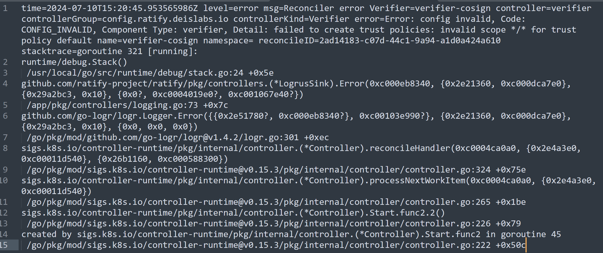


#### Conflict scopes from multiple policies in cosign verifier | Binbin

##### Current Error
Failed to create cosign verifier. Error log: 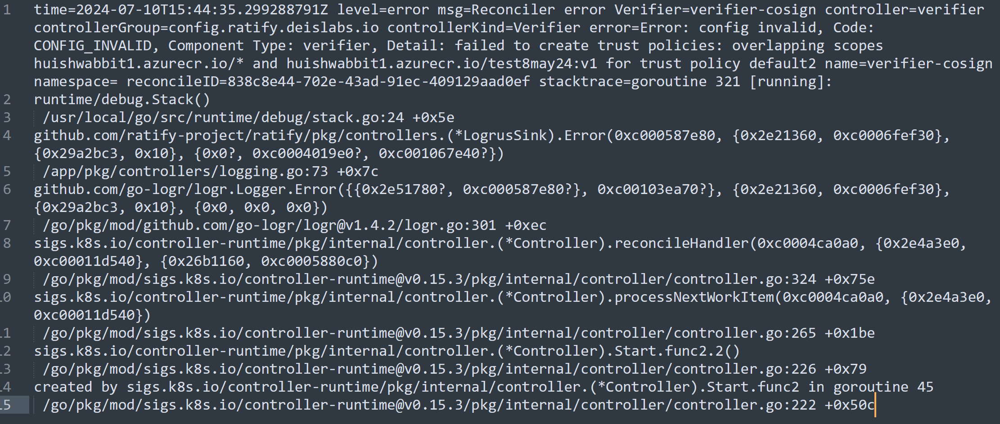


#### Invalid cert identity/cert OIDC issuer for keyless cosign verifier | Binbin

##### Current Error
Terminal response: 
```
Error from server (Forbidden): admission webhook "validation.gatekeeper.sh" denied the request: [ratify-constraint] Subject failed verification: libinbinacr.azurecr.io/testcosign@sha256:f2502800f0663995420b13214a0d20eae1ec9a3c072f99c462cef0132a684556
``` 
Error log: 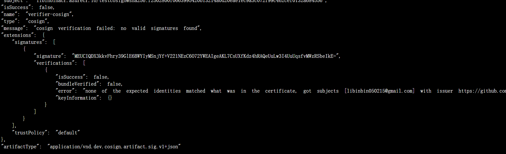

#### Configured keyless cosign verifier to verify a keyed signature | Binbin

##### Current Error
Terminal response: 
```
Error from server (Forbidden): admission webhook "validation.gatekeeper.sh" denied the request: [ratify-constraint] Subject failed verification: libinbinacr.azurecr.io/testimage@sha256:f2502800f0663995420b13214a0d20eae1ec9a3c072f99c462cef0132a684556
``` 
Error log: 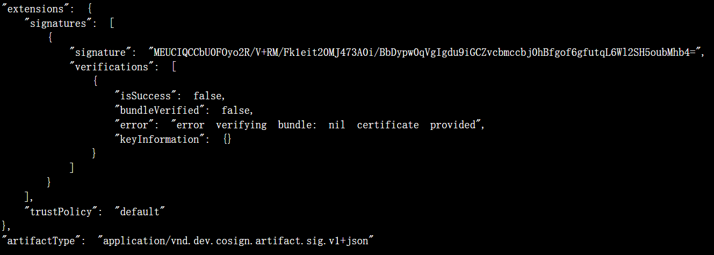

#### Cosign verifier configured a wrong public key | Binbin

##### Current Error
Terminal response: 
```
Error from server (Forbidden): admission webhook "validation.gatekeeper.sh" denied the request: [ratify-constraint] Subject failed verification: libinbinacr.azurecr.io/testimage@sha256:f2502800f0663995420b13214a0d20eae1ec9a3c072f99c462cef0132a684556
```
Error log: 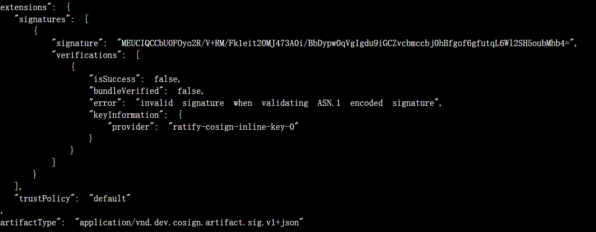

#### Cosign verifier references non-existent kmp | Binbin

##### Current Error
Error log: 
```
cosign verification failed: Error: config invalid, Code: CONFIG_INVALID, Plugin Name: verifier-cosign, Component Type: verifier, Detail: trust policy [default] failed to access key management provider ratify-cosign-inline-key-1, err: failed to access non-existent key management provider: ratify-cosign-inline-key-1
```

### Policy

#### `metadata.name` is changed other than ratify-policy | Binbin

##### Current Error
Error log while applying the CR:
```
metadata.name must be ratify-policy, got ratify-policy2
```
It will keep using the previous policy.

#### Invalid spec.type | Binbin

##### Current Error
Error log after applying CR: 
```
time=2024-07-18T06:58:03.394537164Z level=error msg=unable to create policy from policy crd: failed to create policy enforcer: failed to create policy provider: Error: policy provider not found, Code: POLICY_PROVIDER_NOT_FOUND, Plugin Name: configpolicy2, Component Type: policyProvider, Documentation: https://ratify.dev/docs/reference/crds/policies, Detail: policy type: configpolicy2 is not registered policy provider
``` 
And it will keep using the previous policy

#### Invalid policy value except `all` and `or` in config policy | Binbin

##### Current Error

No error log upon applying CR. 
Terminal response on deployment: 
```
Error from server (Forbidden): admission webhook "validation.gatekeeper.sh" denied the request: [ratify-constraint] Subject failed verification: libinbinacr.azurecr.io/testimage2@sha256:f2502800f0663995420b13214a0d20eae1ec9a3c072f99c462cef0132a684556
``` 
No error log.

#### Invalid policy string is provided in rego policy | Binbin

##### Current Error
Error log during applying CR: 
```
time=2024-07-18T08:11:13.480990932Z level=error msg=unable to create policy from policy crd: failed to create policy enforcer: failed to create policy provider: Original Error: (Original Error: (failed to create policy engine: failed to create policy query, err: failed to prepare rego query, err: 1 error occurred: policy.rego:4: rego_parse_error: var cannot be used for rule name), Error: plugin init failure, Code: PLUGIN_INIT_FAILURE, Plugin Name: regopolicy, Component Type: policyProvider, Documentation: https://ratify.dev/docs/reference/providers, Detail: failed to create OPA engine), Error: plugin init failure, Code: PLUGIN_INIT_FAILURE, Plugin Name: regopolicy, Component Type: policyProvider, Documentation: https://ratify.dev/docs/reference/providers, Detail: failed to create policy provider
```

## Access Control
### ACR
#### `AcrPull` role is not assigned | Juncheng
##### Current Error
Error log: 
```
time=2024-07-17T16:28:16.939576441Z level=warning msg=Original Error: (Original Error: (HEAD "https://roacr.azurecr.io/v2/net-monitor/manifests/v2": GET "https://roacr.azurecr.io/oauth2/token?scope=repository%3Anet-monitor%3Apull&service=roacr.azurecr.io": response status code 401: unauthorized: authentication required, visit https://aka.ms/acr/authorization for more information.), Error: repository operation failure, Code: REPOSITORY_OPERATION_FAILURE, Plugin Name: oras), Error: get subject descriptor failure, Code: GET_SUBJECT_DESCRIPTOR_FAILURE, Plugin Name: oras, Component Type: referrerStore, Detail: failed to resolve the subject descriptor component-type=referrerStore go.version=go1.21.10 namespace= trace-id=34b27888-5402-443e-9836-77124c840561
```
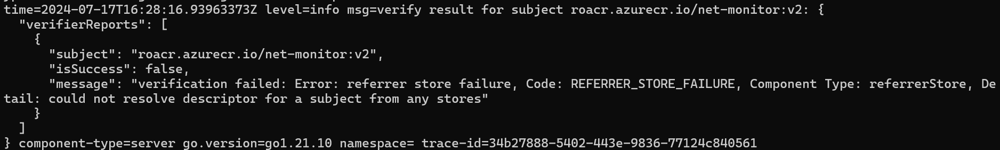

##### Improvement

1. Users just need to know 401 error. 
2. VerifierReports.Message should contain info including 401, repository operation failure and getSubject(optional) 
3. probably different logs for each nested error

### AKV
#### `Key Vault Secrets User` role is not assigned for notation signature | Juncheng

##### Current Error
Error logs:
```
time=2024-07-17T17:40:22.299403863Z level=error msg=authenticity validation failed. Failure reason: unable to fetch certificates for namedStore: certs component-type=verifier go.version=go1.21.10 namespace= trace-id=af227387-267c-4abc-b536-1ad423918726
``` 
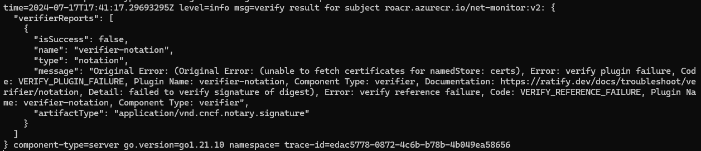

##### Improvement
Reverse error msg and failure reason. Failure during akv fetching. Potential reason: no certs/invalid auth. List all possible reason. **Important: Add error field in KMP to return to verifier.**

#### `Key Vault Crypto User` role is not assigned for cosign signature | Juncheng

##### Current Error
Error log: 
```
time=2024-07-17T19:01:24.928790514Z level=error msg=Reconciler error KeyManagementProvider=keymanagementprovider-akv controller=keymanagementprovider controllerGroup=config.ratify.deislabs.io controllerKind=KeyManagementProvider error=failed to create key management provider provider: Original Error: (Original Error: (failed to acquire token: failed to acquire AAD token: FromAssertion(): http call(https://login.microsoftonline.com/72f988bf-86f1-41af-91ab-2d7cd011db47/oauth2/v2.0/token)(POST) error: reply status code was 401:{"error":"invalid_client","error_description":"AADSTS70025: Client application has no configured federated identity credentials. Trace ID: 479893ff-f447-44d8-abbe-da02e9897300 Correlation ID: fa4c8a02-7d90-4858-9951-e485843c66e1 Timestamp: 2024-07-17 19:01:24Z","error_codes":[70025],"timestamp":"2024-07-17 19:01:24Z","trace_id":"479893ff-f447-44d8-abbe-da02e9897300","correlation_id":"fa4c8a02-7d90-4858-9951-e485843c66e1"}), Error: auth denied, Code: AUTH_DENIED, Plugin Name: azurekeyvault, Component Type: keyManagementProvider, Documentation: https://learn.microsoft.com/en-us/azure/key-vault/general/overview, Detail: failed to get authorizer for keyvault client, Stack trace:(omit_stack_trace)), Error: plugin init failure, Code: PLUGIN_INIT_FAILURE, Plugin Name: azurekeyvault, Component Type: keyManagementProvider, Documentation: https://learn.microsoft.com/en-us/azure/key-vault/general/overview, Detail: failed to create keyvault client name=keymanagementprovider-akv namespace= reconcileID=28f52896-543a-48de-8770-9820d9d6b063
```

##### Improvement
KMP state is invalid/KMP cached certs/keys

## Signature Verification

#### No matching verifier for notation signature | Akash
##### Test Error
Terminal Response: 
```
Error from server (Forbidden): admission webhook "validation.gatekeeper.sh" denied the request: [ratify-constraint] Subject failed verification: ghcr.io/ratify-project/ratify/notary-image@sha256:8e3d01113285a0e4aa574da8eb9c0f112a1eb979d72f73399d7175ba3cdb1c1b
```  
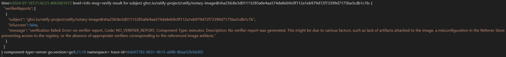
Rego policy will not show any message simply shows:`{"verifierReports": []}`

##### Improvment
1. Provide artifactType. 
2. Message: failed to verify the artifact of type ... 
3. Reason: no matching verifier configured for ...

#### No matching verifier for cosign signature | Akash
##### Test Error
Same behavior as previous test case. 
Terminal Response: 
```
Error from server (Forbidden): admission webhook "validation.gatekeeper.sh" denied the request: [ratify-constraint] Subject failed verification:
``` 
Rego policy will not show any message simply shows:`{"verifierReports": []}`

#### Image is not signed | Akash

##### Current Error
Terminal Response: 
```
Error from server (Forbidden): admission webhook "validation.gatekeeper.sh" denied the request: [ratify-constraint] Subject failed verification: docker.io/library/hello-world@sha256:1408fec50309afee38f3535383f5b09419e6dc0925bc69891e79d84cc4cdcec6
``` 

Rego policy will not show any message simply shows:`{"verifierReports": []}`

##### Improvement
Reason: artifact is not signed or signature is found

#### Image is signed with notation signature, but KMP provides a different certificate resulting to verification failure | Akash

##### Current Error
Terminal response: 
```
Error from server (Forbidden): admission webhook "validation.gatekeeper.sh" denied the request: [ratify-constraint] Subject failed verification: ghcr.io/ratify-project/ratify/notary-image@sha256:8e3d01113285a0e4aa574da8eb9c0f112a1eb979d72f73399d7175ba3cdb1c1b
``` 
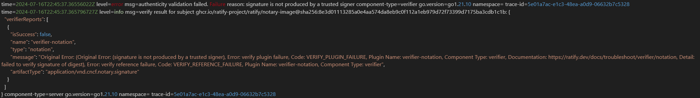

##### Improvement
Probably need more accurate or descriptive msg from notation-go

#### Image is signed with cosign signature, but KMP provides a different key resulting to verification failure | Akash
##### Current Error
Terminal Response: 
```
Error from server (Forbidden): admission webhook "validation.gatekeeper.sh" denied the request: [ratify-constraint] Subject failed verification: generaltest.azurecr.io/cosign/hello-world@sha256:d37ada95d47ad12224c205a938129df7a3e52345828b4fa27b03a98825d1e2e7
``` 
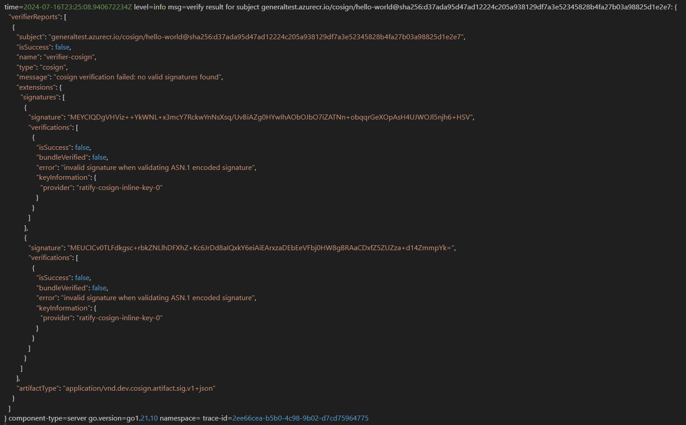

#### Images are signed by unknown identities so that verification should fail. (Notary Project signatures) | Akash

##### Current Error
Terminal Response: 
```
Error from server (Forbidden): admission webhook "validation.gatekeeper.sh" denied the request: [ratify-constraint] Subject failed verification: ghcr.io/ratify-project/ratify/notary-image@sha256:8e3d01113285a0e4aa574da8eb9c0f112a1eb979d72f73399d7175ba3cdb1c1b
``` 

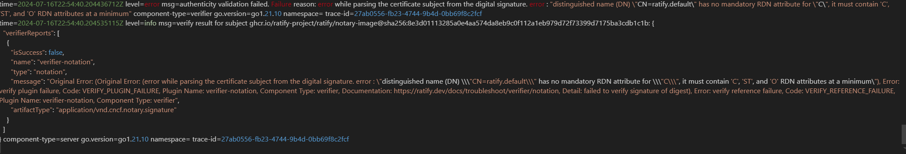

##### Improvement
same as prev case that uses different cert

#### Images are signed by unknown keys so that verification should fail (Cosign key-pair signatures) | Akash
##### Current Error

Terminal Response: 
```
Error from server (Forbidden): admission webhook "validation.gatekeeper.sh" denied the request: [ratify-constraint] Subject failed verification: generaltest.azurecr.io/cosign/hello-world@sha256:d37ada95d47ad12224c205a938129df7a3e52345828b4fa27b03a98825d1e2e7
```


#### Revocation: Images are signed with revoked certificates
#### Timestamp: Images are signed before certificate expired but cert is expired now (Time-stamp support is required and users specify TSA root certificate)
#### Images are signed with multiple signatures, but some signature is missing matching verifier | Binbin
##### Current Error
It passes using config-policy, but can fail using rego-policy. 
Terminal response: 
```
Error from server (Forbidden): admission webhook "validation.gatekeeper.sh" denied the request: [ratify-constraint] Subject failed verification: libinbinacr.azurecr.io/testimage@sha256:f2502800f0663995420b13214a0d20eae1ec9a3c072f99c462cef0132a684556
```
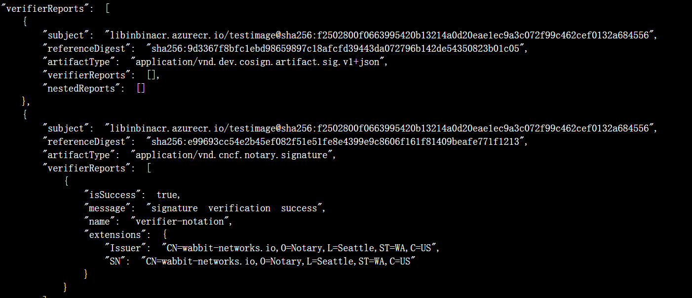

#### Images are signed with multiple signatures, and policy requires all signatures pass. | Binbin
##### Current Error
Terminal response: 
```
Error from server (Forbidden): admission webhook "validation.gatekeeper.sh" denied the request: [ratify-constraint] Subject failed verification: libinbinacr.azurecr.io/testimage@sha256:f2502800f0663995420b13214a0d20eae1ec9a3c072f99c462cef0132a684556
```
Error log: 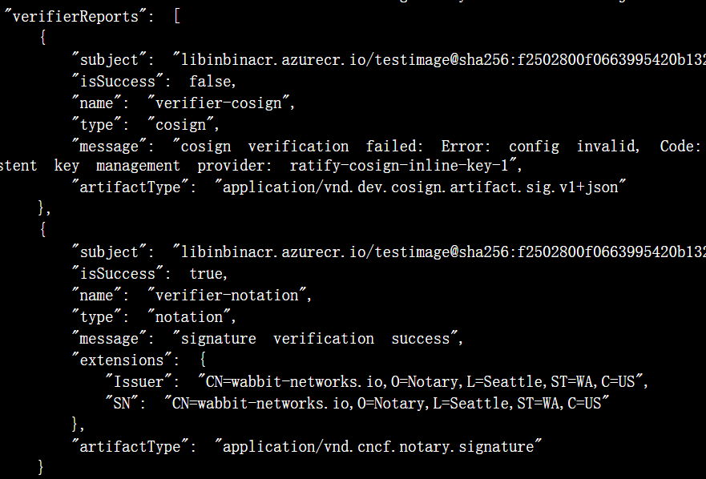

#### Images are signed with multiple signatures, and no matching verifiers configured | Binbin
##### Current Error
Terminal response: 
```
Error from server (Forbidden): admission webhook "validation.gatekeeper.sh" denied the request: [ratify-constraint] Error validating one or more images: ["libinbinacr.azurecr.io/testimage@sha256:f2502800f0663995420b13214a0d20eae1ec9a3c072f99c462cef0132a684556", "Error: config invalid, Code: CONFIG_INVALID, Component Type: verifier, Detail: verifiers config should have at least one verifier"]
``` 
 
#### Images are signed with multiple signatures, and policy requires at least one signature pass | Binbin
##### Current Error
Terminal response: 
```
Error from server (Forbidden): admission webhook "validation.gatekeeper.sh" denied the request: [ratify-constraint] Subject failed verification: libinbinacr.azurecr.io/testimage@sha256:f2502800f0663995420b13214a0d20eae1ec9a3c072f99c462cef0132a684556
```
Error log: 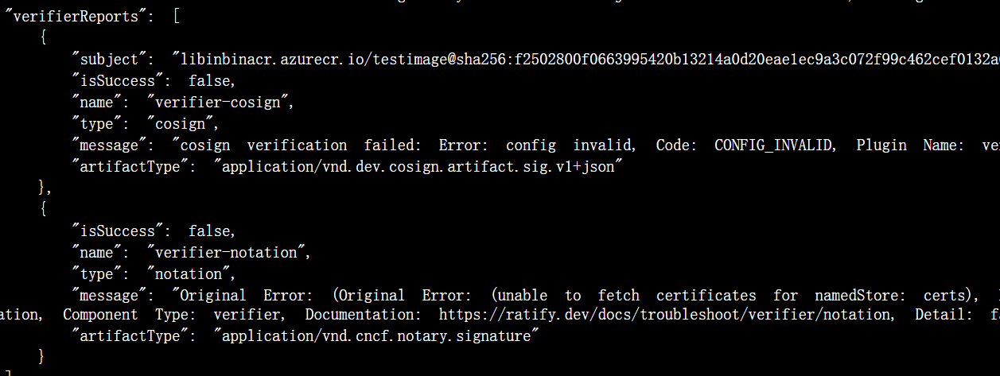

##### Improvement
print notation signature digest

#### certificate is rotated, but Ratify didn't refresh it and previous cert is expired | Binbin
##### Current Error
Terminal Response: 
```
Error from server (Forbidden): admission webhook "validation.gatekeeper.sh" denied the request: [ratify-constraint] Subject failed verification: libinbinacr.azurecr.io/testimage@sha256:f2502800f0663995420b13214a0d20eae1ec9a3c072f99c462cef0132a684556
```
Error Log: 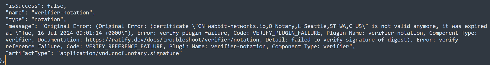

#### key is rotated, but Ratify didn't refresh it | Binbin
##### Current Error
Terminal response:
```
Error from server (Forbidden): admission webhook "validation.gatekeeper.sh" denied the request: [ratify-constraint] Subject failed verification: libinbinacr.azurecr.io/testimage@sha256:f2502800f0663995420b13214a0d20eae1ec9a3c072f99c462cef0132a684556
```
Error log: 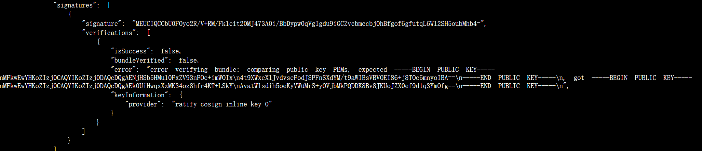

#### Timeout during keyless cosign verification
#### Timeout from requests to remote registry
#### Timeout during cert revocation evaluation for notation signature
Reference: https://github.com/notaryproject/specifications/blob/main/specs/trust-store-trust-policy.md#certificate-revocation-evaluation