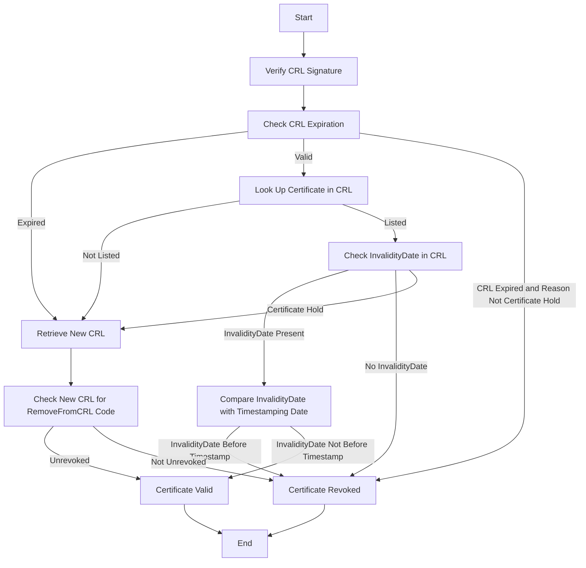

# CRL and CRL Cache Design

## Intro

Certificate validation is an essential step during signature validation. Currently Ratify supports checking for revoked certificates through OCSP supported by notation-go library. However, OCSP validation requires internet connection for each validation while CRL could be cached for better performance. As notary-project is adding the CRL support for notation signature validation, Ratify could utilize it.

## Goals

- CRL support, including CRL downloading, validation, and revocation list checks
- Define a cache provider interface for CRL
- Implement default file-based cache implementation for both CLI and K8S
- Implement preload CRL when cert added from KMP
- Update CRL and CRL caching related documentation

## Design Points

**How to Get CRL**

With no extra configuration, CRL download location (URL) can be obtained from the certificate's CRL Distribution Point (CDP) extension. If the CRL cannot be downloaded within the timeout threshold the revocation result will be "revocation unavailable". More details are showing in the Download CRL section

**Why Caching**

Preload CRL can help improve the performance verifier from download CRLs when a single CRL can be up to 64MiB. Prefer ratify cache for reuse the cache provider interface. Reusing interfaces reduces redundant expressions, helps you easily maintain application objects

**Why Refresh CRL Cache**

A CRL is considered expired if the current date is after the `NextUpdate` field in the CRL. Verify that the CRL is valid (not expired) is necessary for revocation check. Monitoring and refreshing CRL on a regular basis can help avoid CRL download timetaken when doing verification by ensure the CRL is valid.

## Proposed Design


Ratify Verification Request Path:

Step 1: Apply the CRs including certs and CRL config
Step 2: Load CRLs from cert provided URLs
Step 3: Trigger Refresh Monitor and set up refresh schedule
Step 4: Start verify task
Step 5: Load trust policy
Step 6: Load CRL cache

CRL Handler:

Step 1: Load cert URLs
Step 2: Download CRL
Step 3: Trigger Refresh Monitor, refresh monitor is `time` pkg based.

### Cache Content Design

    
Key: 
- `uri` in type `string`

Value: 
- `bundle` in type `*Bundle`
- `ttl` / `NextUpdate`: in type `time.Time`


Check CRL Cache Validity
```
// OPTION 1 creates an expiring cache
expires := bundle.Metadata.CreatedAt.Add(cache.MaxAge)
if cache.MaxAge > 0 && time.Now().After(expires) {
	return nil, ErrCacheMiss
}

// OPTION 2 directly checks CRL validity
now := time.Now()
if !crl.NextUpdate.IsZero() && now.After(crl.NextUpdate) {
	return fmt.Errorf("expired CRL. Current time %v is after CRL NextUpdate %v", now, crl.NextUpdate)
}
```

### Load CRL Cache

Load cache is triggerred after cert loaded from the configurations.

#### Download CRL

CRL download location (URL) can be obtained from the certificate's CRL Distribution Point (CDP) extension. 
If the certificate contains multiple CDP locations then each location download is attempted in sequential order, until a 2xx response is received for any of the location. 

For each CDP location, Notary Project verification workflow will try to download the CRL for the default threshold of 5 seconds. The user may be able to configure this threshold. If the CRL cannot be downloaded within the timeout threshold the revocation result will be "revocation unavailable".

#### Save CRL to Cache

```
// Set stores the CRL bundle in the file system
// check closest expired date and set to `CRLCacheProvider`. Similar to `SetWithTTL`
// save to temp file and use `file` to avoid concurrency issue
// rename is atomic on UNIX-like platforms

```

### Provide CRL Cache

#### Get Cache from Provider

```
// Get retrieves the CRL bundle from the file system
//
// - if the key does not exist, return ErrNotFound
// - if the CRL is expired, return ErrCacheMiss
```

#### Refresh Cache

- When set cache, check closest expired date and set to `CRLCacheProvider`. Similar to `SetWithTTL`
- Config a refresh interval, monitor and refresh `CRLCacheProvider`
- Concurrency

Cache Data Structure: Store data along with expiration timestamps.
Monitor Scheduler: Use a scheduler (e.g., time.Ticker) to check the cache at regular intervals.
Concurrency: Use synchronization mechanisms like mutexes for thread-safe access to shared data.
Expiration Handling: Compare the current time with the cache item's expiration. If expired, trigger the fetch process to update the data.
Error Handling and Retries: Implement error handling with retry logic in case of failed refresh operations.

Use synchronization primitives like mutexes to ensure thread safety during cache updates.

```
// OPTION 1: Monitor starts a goroutine to monitor and refresh expired cache in CRLCacheProviders.

// OPTION 2: time.ticker

// Set TTL
```

# More details

**Brief Aside about CRL and CRL Cache**

X.509 defines one method of certificate revocation. This method involves each CA periodically issuing a signed data structure called a certificate revocation list (CRL).

A CRL is a time stamped list identifying revoked certificates which is signed by a CA or CRL issuer and made freely available in a public repository. Each revoked certificate is identified in a CRL by its certificate serial number.

When a certificate-using system uses a certificate (e.g., for verifying a remote user's digital signature), that system not only checks the certificate signature and validity but also acquires a suitably-recent CRL and checks that the certificate serial number is not on that CRL.
The meaning of "suitably-recent" may vary with local policy, but it usually means the most recently-issued CRL.

A new CRL is issued on a regular periodic basis (e.g., hourly, daily, or weekly).
An entry is added to the CRL as part of the next update following notification of revocation. An entry MUST NOT be removed from the CRL until it appears on one regularly scheduled CRL issued beyond the revoked certificate's validity period.

Implementations of the Notary Project verification specification support only HTTP CRL URLs.

**Revocation Checking with CRL**

To check the revocation status of a certificate against CRL, the following steps must be performed:

1. Verify the CRL signature.
1. Verify that the CRL is valid (not expired).
   A CRL is considered expired if the current date is after the `NextUpdate` field in the CRL.
1. Look up the certificate’s serial number in the CRL.
    1. If the certificate’s serial number is listed in the CRL, look for `InvalidityDate`.
       If CRL has an invalidity date and artifact signature is timestamped then compare the invalidity date with the timestamping date.
       1. If the invalidity date is before the timestamping date, the certificate is considered revoked.
       1. If the invalidity date is not present in CRL, the certificate is considered revoked.
    1. If the CRL is expired and the certificate is listed in the CRL for any reason other than `certificate hold`, the certificate is considered revoked.
    1. If the certificate is not listed in the CRL or the revocation reason is `certificate hold`, a new CRL is retrieved if the current time is past the time in the `NextPublish` field in the current CRL.
       The new CRL is then checked to determine if the certificate is revoked.
       If the original reason was `certificate hold`, the CRL is checked to determine if the certificate is unrevoked by looking for the `RemoveFromCRL` revocation code.



**rfc3280** 

REF: [Internet X.509 Public Key Infrastructure](https://www.rfc-editor.org/rfc/rfc3280#section-1)
