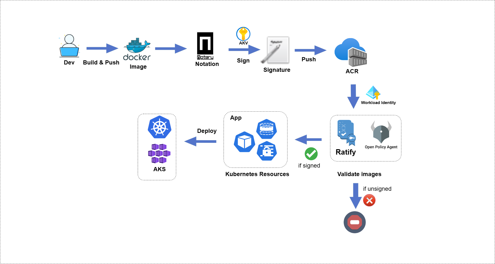

# Ratify on Azure: Allow only signed images to be deployed on AKS with Notation and Ratify

The signed container images enable users to assure deployments are built from a trusted entity and verify images haven't been tampered with since their creation. The signed image ensures integrity and authenticity before the user pulls an image into any environment and avoid attacks. 

Azure Key Vault (AKV) stores a signing key, Notation and the Notation AKV plugin (azure-kv) consumes this key to sign and verify container images and other artifacts. Azure Container Registry (ACR) allows you to store and distribute signed images with signatures.

This article walks you through an end-to-end workflow of validating and enforcing only signed images are allowed to be deployed on AKS with Notation and Ratify.

In this article:

* Create an AKS cluster with Azure Workload Identity configured
* Install Ratify and OPA Gatekeeper
* Deploy two sample images on AKS
* Validate the signature associated with the sample image using Ratify and Gatekeeper



## Prerequisite

Complete the steps in [Build, sign, and verify container images using Notary and Azure Key Vault (Preview)](https://learn.microsoft.com/en-us/azure/container-registry/container-registry-tutorial-sign-build-push#build-and-sign-a-container-image). Please note you need to have a signed image and configure the environment variables before getting started with the following steps.

## Create and configure Azure Workload Identity

Ratify pulls artifacts from a private Azure Container Registry using Workload Federated Identity in an Azure Kubernetes Service cluster. For an overview on how workload identity operates in Azure, refer to the [documentation](https://docs.microsoft.com/en-us/azure/active-directory/develop/workload-identity-federation). You can use workload identity federation to configure an Azure AD app registration or user-assigned managed identity. The following workflow includes the Workload Identity configuration.

1. Configure environment variables.

    ```bash
    export IDENTITY_NAME=<Identity Name>
    export GROUP_NAME=<Azure Resource Group Name>
    export SUBSCRIPTION_ID=<Azure Subscription ID>
    export TENANT_ID=<Azure Tenant ID>
    export AKS_NAME=<Azure Kubernetes Service Name>
    export RATIFY_NAMESPACE=<Namespace where Ratify deployed, defaults to "gatekeeper-system">
    ```

2. Create a Workload Federated Identity.

    ```bash
    az identity create --name "${IDENTITY_NAME}" --resource-group "${GROUP_NAME}" --location "${LOCATION}" --subscription "${SUBSCRIPTION_ID}"

    export IDENTITY_OBJECT_ID="$(az identity show --name "${IDENTITY_NAME}" --resource-group "${GROUP_NAME}" --query 'principalId' -otsv)"
    export IDENTITY_CLIENT_ID=$(az identity show --name ${IDENTITY_NAME} --resource-group ${GROUP_NAME} --query 'clientId' -o tsv)
    ```

> Note: If you have identity authentication issues on your local machine, you can use Azure Cloud Shell to complete this section.

## Configure workload identity for ACR

Configure user-assigned managed identity and enable `AcrPull` role to the workload identity.

    ```bash
    az role assignment create \
    --assignee-object-id ${IDENTITY_OBJECT_ID} \
    --role acrpull \
    --scope subscriptions/${SUBSCRIPTION_ID}/resourceGroups/${GROUP_NAME}/providers/Microsoft.ContainerRegistry/registries/${ACR_NAME}
    ```

## Create an OIDC enabled AKS cluster and configure workload identity

1. Create an OIDC enabled AKS cluster by following the steps below. You can skip this step if you have an AKS cluster with OIDC enabled.

    ```bash
    # Install the aks-preview extension
    az extension add --name aks-preview

    # Register the 'EnableWorkloadIdentityPreview' feature flag
    az feature register --namespace "Microsoft.ContainerService" --name "EnableWorkloadIdentityPreview"
    az provider register --namespace Microsoft.ContainerService

    az aks create \
        --resource-group "${GROUP_NAME}" \
        --name "${AKS_NAME}" \
        --node-vm-size Standard_DS3_v2 \
        --node-count 1 \
        --generate-ssh-keys \
        --enable-workload-identity \
        --attach-acr ${ACR_NAME} \
        --enable-oidc-issuer

    # Connect to the AKS cluster:
    az aks get-credentials --resource-group ${GROUP_NAME} --name ${AKS_NAME}

    export AKS_OIDC_ISSUER="$(az aks show -n ${AKS_NAME} -g ${GROUP_NAME} --query "oidcIssuerProfile.issuerUrl" -otsv)"
    ```

> Note: The official steps for setting up Workload Identity on AKS can be found [here](https://azure.github.io/azure-workload-identity/docs/quick-start.html).

2. This step above may take around 10 minutes to complete. The registration status can be checked by running the following command:

    ```bash
    az feature show --namespace "Microsoft.ContainerService" --name "EnableWorkloadIdentityPreview" -o table
    Name                                                      RegistrationState
    --------------------------------------------------------    -------------------
    Microsoft.ContainerService/EnableWorkloadIdentityPreview    Registered
    ```

3. Establish federated identity credential. On AZ CLI `${RATIFY_NAMESPACE}` is where you deploy Ratify:

    ```bash
    az identity federated-credential create \
    --name ratify-federated-credential \
    --identity-name "${IDENTITY_NAME}" \
    --resource-group "${GROUP_NAME}" \
    --issuer "${AKS_OIDC_ISSUER}" \
    --subject system:serviceaccount:"${RATIFY_NAMESPACE}":"ratify-admin"
    ```

## Configure access policy for AKV 

> Note: Azure Key Vault integration currently only support self signed certificate, if you are working with a certificate chain, please specify the public root certificate value inline using the [inline certificate provider](../reference/crds/certificate-stores.md#inline-certificate-provider).

1. Set the environmental variable for Azure Key Vault URI.

    ```bash
    export VAULT_URI=$(az keyvault show --name ${AKV_NAME} --resource-group ${GROUP_NAME} --query "properties.vaultUri" -otsv)
    ```

2. Import your own private key and certificates. You can import it on the portal as well.

    ```bash
    az keyvault certificate import \
    --vault-name ${AKV_NAME} \
    -n ${KEY_NAME} \
    -f ${CERT_PATH}
    ```
   
3. Configure policy for user-assigned managed identity:
    
    ```bash
    az keyvault set-policy --name ${AKV_NAME} \
    --secret-permissions get \
    --object-id ${IDENTITY_OBJECT_ID}
    ```

## Deploy Gatekeeper and Ratify on AKS 

1. Deploy Gatekeeper from helm chart:

    ```bash
    helm repo add gatekeeper https://open-policy-agent.github.io/gatekeeper/charts

    helm install gatekeeper/gatekeeper  \
    --name-template=gatekeeper \
    --namespace gatekeeper-system --create-namespace \
    --set enableExternalData=true \
    --set validatingWebhookTimeoutSeconds=5 \
    --set mutatingWebhookTimeoutSeconds=2
    ```

2. Install Ratify on AKS from helm chart:

    ```bash
    # Add a Helm repo
    helm repo add ratify https://deislabs.github.io/ratify

    # Install Ratify
    helm install ratify \
        ./charts/ratify --atomic \
        --namespace ${RATIFY_NAMESPACE} --create-namespace \
        --set akvCertConfig.enabled=true \
        --set akvCertConfig.vaultURI=${VAULT_URI} \
        --set akvCertConfig.cert1Name=${KEY_NAME} \
        --set akvCertConfig.tenantId=${TENANT_ID} \
        --set oras.authProviders.azureWorkloadIdentityEnabled=true \
        --set azureWorkloadIdentity.clientId=${IDENTITY_CLIENT_ID}
    ```

3. Enforce Gatekeeper policy to allow only signed images can be deployed on AKS:

    ```bash
    kubectl apply -f https://deislabs.github.io/ratify/library/default/template.yaml
    kubectl apply -f https://deislabs.github.io/ratify/library/default/samples/constraint.yaml
    ```

## Deploy two sample image to AKS cluster

1. Run a Pod using an image that you have signed in the previous step. Ratify will verify if this image has a valid signature.

    ```bash
    $ kubectl run ratify-demo-signed --image=$IMAGE
    Pod ratify-demo-signed created
    ```

2. Deploy an unsigned image to AKS cluster. The deployment has been denied since the image has not been signed and doesn't meet the deployment criteria. 

    ```bash
    $ kubectl run ratify-demo-unsigned --image=unsigned:v1
    Error from server (Forbidden): admission webhook "validation.gatekeeper.sh" denied the request: [ratify-constraint] Subject failed verification: wabbitnetworks.azurecr.io/test/net-monitor:unsigned
    ```