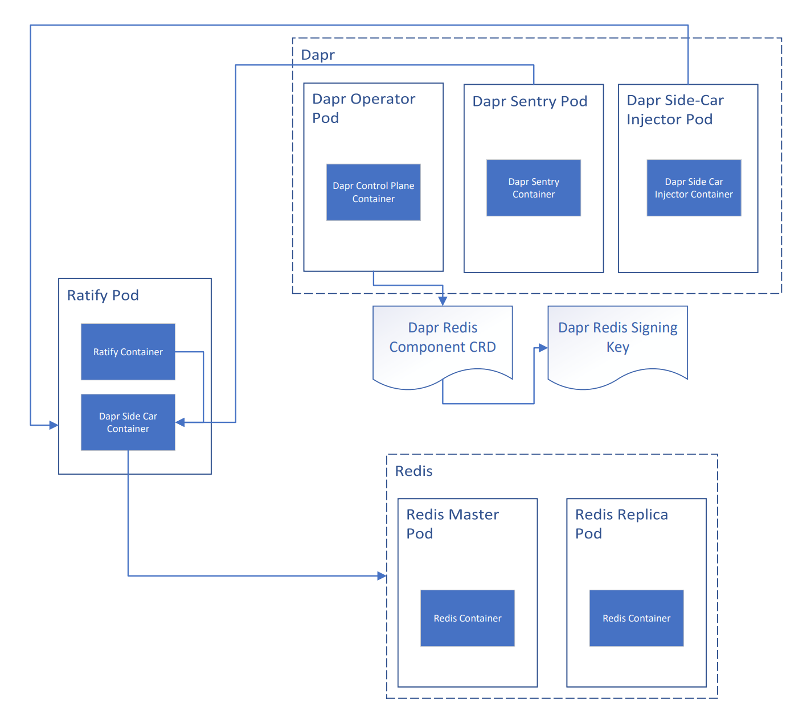
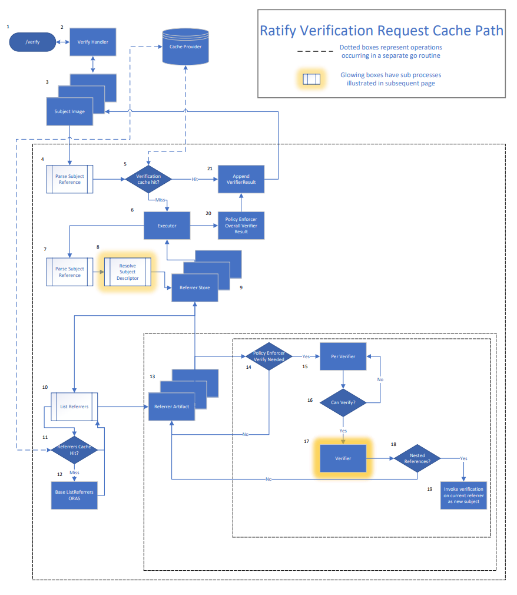
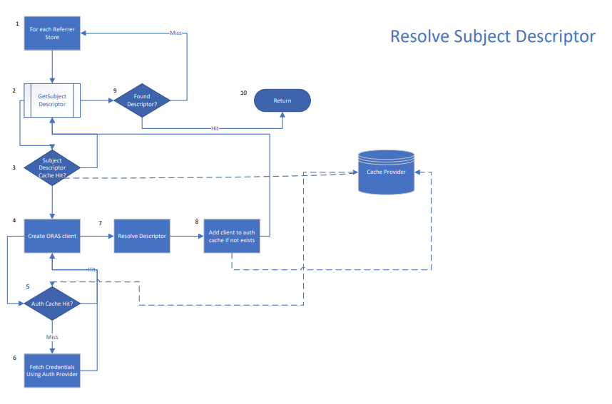
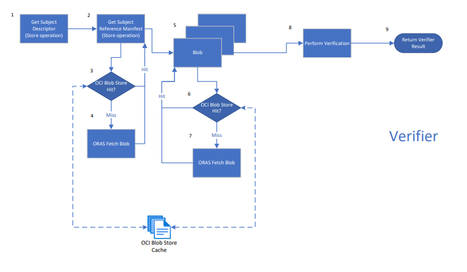

# Caching in Ratify

Ratify supports memory caches and file-based blob caching. 
## Memory Caches

Ratify provides a unified cache API for cache read/write. Caching providers implement the API and are registered on ratify creation. Users can configure which cache provider to use via helm chart/cli. Here are the current cche providers supported:

### Ristretto (default)

Ristretto is a highly performant in-memory caching library. The ristretto cache is configured as LRU.
See [docs](https://github.com/dgraph-io/ristretto).

When to use Ristretto as the cache provider?
- using the ratify quick start
- only using ratify with notary verifier configured
- using ratify as a single pod

### Dapr

Dapr (Distributed Application Runtime) supports many different state-stores both open source and cloud specific. Redis is the prefferred state-store implementation. Redis is a memory-based key-value distributed data-store. It is atomic and highly concurrent making it a good fit for distributed applications with multiple readers and writers. Ratify uses Redis as a centralized cache shared across multiple processes (each external plugin is run as a separate process) and across mutliple ratify replicas.

Ratify REQUIRES that each Dapr state store be configured with a primary encryption key in order to guarantee confidentiality of the cached data at rest. Please see guide [here](../examples/ratify-high-availability.md) on installing Ratify with Dapr Redis integration.

The Ratify chart does NOT come with built-in installation support for Dapr or Redis. User's must manage and configure on their own.

When to use Redis as the cache provider?
- using multiple verifiers including external plugins
- using high availability ratify deployment (multiple replicas)

Here's a diagram of the relationship between the cluster resources installed with Dapr + Redis + Ratify:

The centralized cache is currently used in 4 different scenarios:
- Verify Request
    - cache key: `cache_ratify_verify_handler_<INSERT_IMAGE_REF>`
    - description: Caches external data response sent by the `/verify` handler. This cache is required when Ratify gets multiple simulataneous requests for verification of the same image. Cache items should be very short lived.
- Subject Descriptor Resolution
    - cache key: `cache_ratify_subject_descriptor_<DIGEST>`
    - description: Digest-based fully-qualifed subject image reference key to a resolved subject descriptor. This is used by the `GetSubjectDescriptor` ORAS store implementation. The `/mutate` path heavily relies on this cache due to the often redundant mutate requests Ratify gets during K8s resource creation.
- Authentication Credentials
    - cache key: `cache_ratify_oras_auth_<INSERT_REGISTRY_HOST>`
    - description: Registry host name to `AuthConfig` credentials object returned by the auth provider
- Subject Referrers
    - cache key: `cache_ratify_list_referrers_<INSERT_IMAGE_REF>`
    - description: The cache implementation of `ListReferrers` stores the list of artifact descriptors returned from the registry referrers call. (Note: the cache duration can be specified via `oras.cache.ttl` helm value)

## File store based cache

ORAS provides an OCI layout store for caching blobs in a local file descriptor. Ratify's ORAS store implementation stores all blobs fetched from registry in an OCI store. During verification, blob-related operations (`GetReferenceManifest` & `GetBlobContent`) check the OCI file store for blob existence before making calls to registry.

## Flow Diagrams

