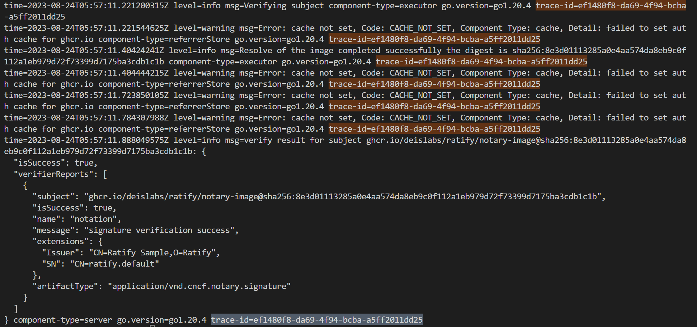

# Logger

## Overview
Logging is a very important part of Ratify as it provides a way to debug and understand the behavior of the system. Ratify uses [Logrus](https://github.com/sirupsen/logrus) as the logging library.

## Usage
Ratify exposes a few options for users to configure the behaviors of the logger in the helm chart values or the configuration file below.

### Configuration
When running Ratify as a K8s add-on, users could configure the logger by setting [helm chart values](../../charts/ratify/values.yaml), e.g.
```yaml
logger:
  formatter: "text"
  level: "info"
  requestHeaders:
    traceIDHeaderName:
      - "x-trace-id"
      - "x-ms-correlation-request-id"
```

### Formatter
Users could set the formatter to be `text`, `json` or `logstash`. The default value is `text` if it's not set.

`json` and `text` are 2 commonly used formats for logging system. `logstash` is another format that's compatible with [Logstash](https://www.elastic.co/logstash).

### Log Levels
Users could configure log level by setting `logger.level` to the expected level. The default value is `info`.

### Request Headers
Ratify supports logging required headers from the external data request and passing to dependency services through the http header. Users could configure the logger to log the request headers by setting the `requestHeaders` field in the config. The `requestHeaders` field is a map of field name to header name(or array of names) in the request.

Fields that Ratify supports logging are:
- `traceIDHeaderName`: The trace ID header names in the request. Ratify will log the trace ID if it's set in the request header. Otherwise, it will generate a new trace ID and log it. Futhermore, since Ratify supports multiple oci-compatible registries, users could specify multiple traceID header names that are used by different registries. Note: 1. external data request MUST have at most one traceID in the header, if users specify multiple traceID header names, they MUST have the same traceID. 2. Http requests from Ratify to remote registries will always have all specified traceID names set to the same traceID in the header.

Example:
```
logger:
  formatter: "text"
  level: "info"
  requestHeaders:
    traceIDHeaderName:
      - "x-ms-correlation-request-id"
```
Add `"x-ms-correlation-request-id"` under `traceIDHeaderName` to support tracing requests across Azure and Ratify.
In Ratify, users could see trace-id is appeneded to each log record.


## Contribution Guide
### Ratify Repo Contributor
For Ratify contributors, you only need to follow 2 steps:
1. Define a constant for the log option or a new log option field within the expecting component struct.
2. Replace the original `logrus.Info` with `logger.GetLogger(ctx, logOpt).Info()`, which applies to all log levels.
e.g. [executor](../../pkg/executor/core/executor.go)
```go
import "github.com/deislabs/ratify/internal/logger"
var logOpt = logger.Option{
	ComponentType: logger.Executor,
}
logger.GetLogger(ctx, logOpt).Info("test")
```

### External Plugin Developer
For external plugins, if you want to leverage features provided by Ratify, like the trace-id, please follow 2 steps:
1. Import `github.com/docker/distribution/context`
2. Replace the original `logrus.Info` with `context.GetLogger.Info()`, which applies to all log levels.
e.g.
```go
import "github.com/docker/distribution/context"
dcontext.GetLogger(ctx).Info("test")
```